LiST: Lite Prompted Self-training Makes Parameter-Efficient Few-shot Learners — Arxiv Link)
Composable Sparse Fine-Tuning for Cross-Lingual Transfer — Arxiv Link)
Efficient Fine-Tuning of Compressed Language Models with Learners — Arxiv Link)
Task Adaptive Parameter Sharing for Multi-Task Learning — Arxiv Link)
RAG vs Fine-tuning: Pipelines, Tradeoffs, and a Case Study on Agriculture — Arxiv Link)
Scaling Sparse Fine-Tuning to Large Language Models — Arxiv Link)
Exploring and Evaluating Personalized Models for Code Generation — Arxiv Link)
UniPT: Universal Parallel Tuning for Transfer Learning with Efficient Parameter and Memory — Arxiv Link)
Weaver: Foundation Models for Creative Writing — Arxiv Link)
PERFECT: Prompt-free and Efficient Few-shot Learning with Language Models — Arxiv Link)
AdaMix: Mixture-of-Adaptations for Parameter-efficient Model Tuning — Arxiv Link)
AdaMix: Mixture-of-Adaptations for Parameter-efficient Model Tuning — Arxiv Link)
ComPEFT: Compression for Communicating Parameter Efficient Updates via Sparsification and Quantization — Arxiv Link)
Bit Cipher -- A Simple yet Powerful Word Representation System that Integrates Efficiently with Language Models — Arxiv Link)
ConES: Concept Embedding Search for Parameter Efficient Tuning Large Vision Language Models — Arxiv Link)
LeTI: Learning to Generate from Textual Interactions — Arxiv Link)
Polyhistor: Parameter-Efficient Multi-Task Adaptation for Dense Vision Tasks — Arxiv Link)
DSEE: Dually Sparsity-embedded Efficient Tuning of Pre-trained Language Models — Arxiv Link)
SPT: Semi-Parametric Prompt Tuning for Multitask Prompted Learning — Arxiv Link)
HyperTuning: Toward Adapting Large Language Models without Back-propagation — Arxiv Link)

With torch, transformers, and specialized fine tuning of small models we can build to specification of input dataset and easily create RAG agents with fine tuned models using duckduckgo and smolagents.  Show state of art SFT for agentic RAG to help manage models and gain ROI.

# Detailed Research Paper Summary

## 📄 [LiST: Lite Prompted Self-training Makes Parameter-Efficient Few-shot  Learners](https://arxiv.org/abs/2110.06274)

**Authors:** Yaqing Wang, Subhabrata Mukherjee, Xiaodong Liu, Jing Gao, Ahmed  Hassan Awadallah, Jianfeng Gao  
**Date:** ### 18 May 2022  
**Word Count (Title):** 8 | **Word Count (Summary):** 219  

**Links:** [Abstract](https://arxiv.org/abs/2110.06274)) | [PDF](https://arxiv.org/pdf/2110.06274).pdf)

**High Info Terms:** list, is, self-training, fine-tuning, parameters, we, few-shot, learning, over, that, prompt-based, fn, use, as, model  
**ROUGE Score:** 6.85%

### 🎤 TTF Read Aloud
- **Title:** [LiST: Lite Prompted Self-training Makes Parameter-Efficient Few-shot  Learners](https://arxiv.org/abs/2110.06274)
- **Key Terms:** list, is, self-training, fine-tuning, parameters, we, few-shot, learning, over, that, prompt-based, fn, use, as, model
- **ROUGE:** 6.85%

#### Mermaid Graph of Key Concepts
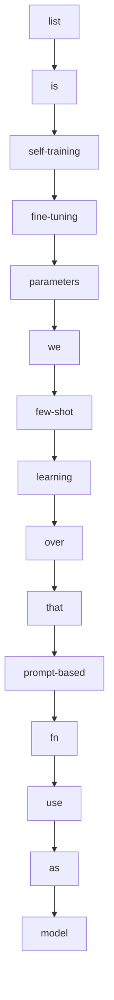

---

## 📄 [Composable Sparse Fine-Tuning for Cross-Lingual Transfer](https://arxiv.org/abs/2110.07560)

**Authors:** Alan Ansell, Edoardo Maria Ponti, Anna Korhonen, Ivan Vuli\'c  
**Date:** ### 09 Feb 2023  
**Word Count (Title):** 6 | **Word Count (Summary):** 218  

**Links:** [Abstract](https://arxiv.org/abs/2110.07560)) | [PDF](https://arxiv.org/pdf/2110.07560).pdf)

**High Info Terms:** fine-tuning, model, adapters, language, we, masks, sparse, be, both, in a, parameters, large, pretrained, transfer, prevent  
**ROUGE Score:** 6.88%

### 🎤 TTF Read Aloud
- **Title:** [Composable Sparse Fine-Tuning for Cross-Lingual Transfer](https://arxiv.org/abs/2110.07560)
- **Key Terms:** fine-tuning, model, adapters, language, we, masks, sparse, be, both, in a, parameters, large, pretrained, transfer, prevent
- **ROUGE:** 6.88%

#### Mermaid Graph of Key Concepts
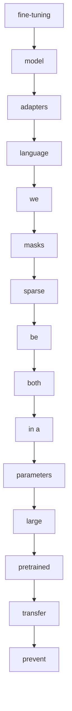

---

## 📄 [Efficient Fine-Tuning of Compressed Language Models with Learners](https://arxiv.org/abs/2208.02070)

**Authors:** Danilo Vucetic, Mohammadreza Tayaranian, Maryam Ziaeefard, James J.  Clark, Brett H. Meyer, Warren J. Gross  
**Date:** ### 03 Aug 2022  
**Word Count (Title):** 8 | **Word Count (Summary):** 131  

**Links:** [Abstract](https://arxiv.org/abs/2208.02070)) | [PDF](https://arxiv.org/pdf/2208.02070).pdf)

**High Info Terms:** fine-tuning, training, learners, models, works, learner, modules, methods, that, convergence, resource, utilization, by, parameters, learner modules  
**ROUGE Score:** 11.45%

### 🎤 TTF Read Aloud
- **Title:** [Efficient Fine-Tuning of Compressed Language Models with Learners](https://arxiv.org/abs/2208.02070)
- **Key Terms:** fine-tuning, training, learners, models, works, learner, modules, methods, that, convergence, resource, utilization, by, parameters, learner modules
- **ROUGE:** 11.45%

#### Mermaid Graph of Key Concepts
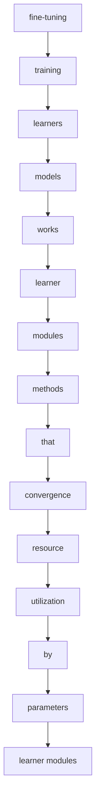

---

## 📄 [Task Adaptive Parameter Sharing for Multi-Task Learning](https://arxiv.org/abs/2203.16708)

**Authors:** Matthew Wallingford, Hao Li, Alessandro Achille, Avinash Ravichandran,  Charless Fowlkes, Rahul Bhotika, Stefano Soatto  
**Date:** ### 30 Mar 2022  
**Word Count (Title):** 7 | **Word Count (Summary):** 183  

**Links:** [Abstract](https://arxiv.org/abs/2203.16708)) | [PDF](https://arxiv.org/pdf/2203.16708).pdf)

**High Info Terms:** tasks, taps, model, downstream, task, base, task-specific, layers, while, downstream tasks, base model, models, learning, fine-tuning, is  
**ROUGE Score:** 8.2%

### 🎤 TTF Read Aloud
- **Title:** [Task Adaptive Parameter Sharing for Multi-Task Learning](https://arxiv.org/abs/2203.16708)
- **Key Terms:** tasks, taps, model, downstream, task, base, task-specific, layers, while, downstream tasks, base model, models, learning, fine-tuning, is
- **ROUGE:** 8.2%

#### Mermaid Graph of Key Concepts
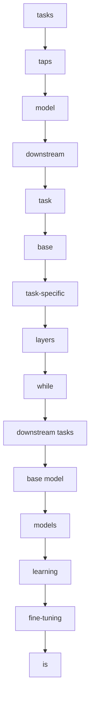

---

## 📄 [RAG vs Fine-tuning: Pipelines, Tradeoffs, and a Case Study on  Agriculture](https://arxiv.org/abs/2401.08406)

**Authors:** Angels Balaguer, Vinamra Benara, Renato Luiz de Freitas Cunha, Roberto  de M. Estev\~ao Filho, Todd Hendry, Daniel Holstein, Jennifer Marsman, Nick  Mecklenburg, Sara Malvar, Leonardo O. Nunes, Rafael Padilha, Morris Sharp,  Bruno Silva, Swati Sharma, Vijay Aski, Ranveer Chandra  
**Date:** ### 30 Jan 2024  
**Word Count (Title):** 11 | **Word Count (Summary):** 281  

**Links:** [Abstract](https://arxiv.org/abs/2401.08406)) | [PDF](https://arxiv.org/pdf/2401.08406).pdf)

**High Info Terms:** fine-tuning, we, rag, llms, pipeline, p, rag and, are, knowledge, model, our, from, results, and fine-tuning, which  
**ROUGE Score:** 5.34%

### 🎤 TTF Read Aloud
- **Title:** [RAG vs Fine-tuning: Pipelines, Tradeoffs, and a Case Study on  Agriculture](https://arxiv.org/abs/2401.08406)
- **Key Terms:** fine-tuning, we, rag, llms, pipeline, p, rag and, are, knowledge, model, our, from, results, and fine-tuning, which
- **ROUGE:** 5.34%

#### Mermaid Graph of Key Concepts
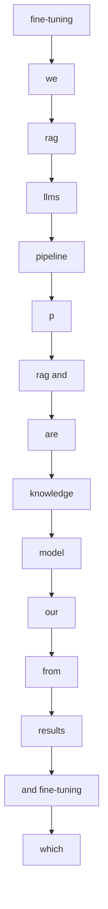

---

## 📄 [Scaling Sparse Fine-Tuning to Large Language Models](https://arxiv.org/abs/2401.16405)

**Authors:** Alan Ansell and Ivan Vuli\'c and Hannah Sterz and Anna Korhonen and  Edoardo M. Ponti  
**Date:** ### 02 Feb 2024  
**Word Count (Title):** 7 | **Word Count (Summary):** 219  

**Links:** [Abstract](https://arxiv.org/abs/2401.16405)) | [PDF](https://arxiv.org/pdf/2401.16405).pdf)

**High Info Terms:** we, their, llms, fine-tuning, spiel, parameters, sparse, terms, indices, deltas, sparse fine-tuning, in terms, terms of, parameter-efficient, methods  
**ROUGE Score:** 6.85%

### 🎤 TTF Read Aloud
- **Title:** [Scaling Sparse Fine-Tuning to Large Language Models](https://arxiv.org/abs/2401.16405)
- **Key Terms:** we, their, llms, fine-tuning, spiel, parameters, sparse, terms, indices, deltas, sparse fine-tuning, in terms, terms of, parameter-efficient, methods
- **ROUGE:** 6.85%

#### Mermaid Graph of Key Concepts
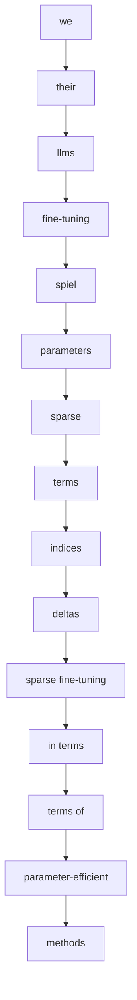

---

## 📄 [Exploring and Evaluating Personalized Models for Code Generation](https://arxiv.org/abs/2208.13928)

**Authors:** Andrei Zlotchevski, Dawn Drain, Alexey Svyatkovskiy, Colin Clement,  Neel Sundaresan, Michele Tufano  
**Date:** ### 20 Sep 2022  
**Word Count (Title):** 8 | **Word Count (Summary):** 226  

**Links:** [Abstract](https://arxiv.org/abs/2208.13928)) | [PDF](https://arxiv.org/pdf/2208.13928).pdf)

**High Info Terms:** model, fine-tuning, we, which, are, code, evaluate, parameters, large, transformer, modeling, learning, token, generalization, personalization  
**ROUGE Score:** 6.64%

### 🎤 TTF Read Aloud
- **Title:** [Exploring and Evaluating Personalized Models for Code Generation](https://arxiv.org/abs/2208.13928)
- **Key Terms:** model, fine-tuning, we, which, are, code, evaluate, parameters, large, transformer, modeling, learning, token, generalization, personalization
- **ROUGE:** 6.64%

#### Mermaid Graph of Key Concepts
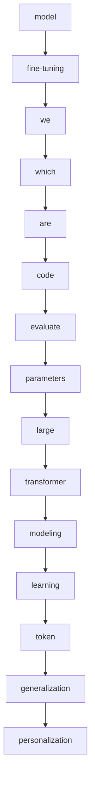

---

## 📄 [UniPT: Universal Parallel Tuning for Transfer Learning with Efficient  Parameter and Memory](https://arxiv.org/abs/2308.14316)

**Authors:** Haiwen Diao, Bo Wan, Ying Zhang, Xu Jia, Huchuan Lu, Long Chen  
**Date:** ### 28 Aug 2023  
**Word Count (Title):** 12 | **Word Count (Summary):** 225  

**Links:** [Abstract](https://arxiv.org/abs/2308.14316)) | [PDF](https://arxiv.org/pdf/2308.14316).pdf)

**High Info Terms:** petl, unipt, pre-trained, methods, we, parallel, that, petl methods, achieve, performance, tasks, parameters, networks, is, transfer  
**ROUGE Score:** 6.67%

### 🎤 TTF Read Aloud
- **Title:** [UniPT: Universal Parallel Tuning for Transfer Learning with Efficient  Parameter and Memory](https://arxiv.org/abs/2308.14316)
- **Key Terms:** petl, unipt, pre-trained, methods, we, parallel, that, petl methods, achieve, performance, tasks, parameters, networks, is, transfer
- **ROUGE:** 6.67%

#### Mermaid Graph of Key Concepts
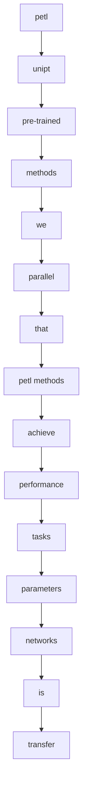

---

## 📄 [Weaver: Foundation Models for Creative Writing](https://arxiv.org/abs/2401.17268)

**Authors:** Tiannan Wang, Jiamin Chen, Qingrui Jia, Shuai Wang, Ruoyu Fang, Huilin  Wang, Zhaowei Gao, Chunzhao Xie, Chuou Xu, Jihong Dai, Yibin Liu, Jialong Wu,  Shengwei Ding, Long Li, Zhiwei Huang, Xinle Deng, Teng Yu, Gangan Ma, Han  Xiao, Zixin Chen, Danjun Xiang, Yunxia Wang, Yuanyuan Zhu, Yi Xiao, Jing  Wang, Yiru Wang, Siran Ding, Jiayang Huang, Jiayi Xu, Yilihamu Tayier, Zhenyu  Hu, Yuan Gao, Chengfeng Zheng, Yueshu Ye, Yihang Li, Lei Wan, Xinyue Jiang,  Yujie Wang, Siyu Cheng, Zhule Song, Xiangru Tang, Xiaohua Xu, Ningyu Zhang,  Huajun Chen, Yuchen Eleanor Jiang, and Wangchunshu Zhou  
**Date:** ### 30 Jan 2024  
**Word Count (Title):** 6 | **Word Count (Summary):** 237  

**Links:** [Abstract](https://arxiv.org/abs/2401.17268)) | [PDF](https://arxiv.org/pdf/2401.17268).pdf)

**High Info Terms:** weaver, writing, llms, models, we, our, family, large, language, content, creation, carefully, improving, capabilities, professional  
**ROUGE Score:** 6.33%

### 🎤 TTF Read Aloud
- **Title:** [Weaver: Foundation Models for Creative Writing](https://arxiv.org/abs/2401.17268)
- **Key Terms:** weaver, writing, llms, models, we, our, family, large, language, content, creation, carefully, improving, capabilities, professional
- **ROUGE:** 6.33%

#### Mermaid Graph of Key Concepts
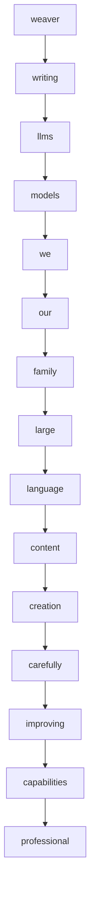

---

## 📄 [PERFECT: Prompt-free and Efficient Few-shot Learning with Language  Models](https://arxiv.org/abs/2204.01172)

**Authors:** Rabeeh Karimi Mahabadi, Luke Zettlemoyer, James Henderson, Marzieh  Saeidi, Lambert Mathias, Veselin Stoyanov, and Majid Yazdani  
**Date:** ### 26 Apr 2022  
**Word Count (Title):** 9 | **Word Count (Summary):** 184  

**Links:** [Abstract](https://arxiv.org/abs/2204.01172)) | [PDF](https://arxiv.org/pdf/2204.01172).pdf)

**High Info Terms:** few-shot, fine-tuning, that, perfect, we, which, methods, plms, engineered, prompts, verbalizers, new, task, can, simple  
**ROUGE Score:** 8.15%

### 🎤 TTF Read Aloud
- **Title:** [PERFECT: Prompt-free and Efficient Few-shot Learning with Language  Models](https://arxiv.org/abs/2204.01172)
- **Key Terms:** few-shot, fine-tuning, that, perfect, we, which, methods, plms, engineered, prompts, verbalizers, new, task, can, simple
- **ROUGE:** 8.15%

#### Mermaid Graph of Key Concepts
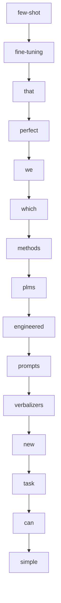

---

## 📄 [AdaMix: Mixture-of-Adaptations for Parameter-efficient Model Tuning](https://arxiv.org/abs/2205.12410)

**Authors:** Yaqing Wang, Sahaj Agarwal, Subhabrata Mukherjee, Xiaodong Liu, Jing  Gao, Ahmed Hassan Awadallah, Jianfeng Gao  
**Date:** ### 02 Nov 2022  
**Word Count (Title):** 6 | **Word Count (Summary):** 191  

**Links:** [Abstract](https://arxiv.org/abs/2205.12410)) | [PDF](https://arxiv.org/pdf/2205.12410).pdf)

**High Info Terms:** fine-tuning, peft, plm, adamix, tasks, parameters, we, method, that, mixture, the plm, peft method, a mixture, mixture of, large  
**ROUGE Score:** 7.85%

### 🎤 TTF Read Aloud
- **Title:** [AdaMix: Mixture-of-Adaptations for Parameter-efficient Model Tuning](https://arxiv.org/abs/2205.12410)
- **Key Terms:** fine-tuning, peft, plm, adamix, tasks, parameters, we, method, that, mixture, the plm, peft method, a mixture, mixture of, large
- **ROUGE:** 7.85%

#### Mermaid Graph of Key Concepts
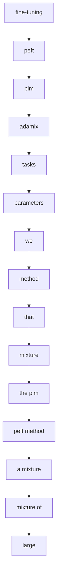

---

## 📄 [AdaMix: Mixture-of-Adaptations for Parameter-efficient Model Tuning](https://arxiv.org/abs/2210.17451)

**Authors:** Yaqing Wang, Sahaj Agarwal, Subhabrata Mukherjee, Xiaodong Liu, Jing  Gao, Ahmed Hassan Awadallah, Jianfeng Gao  
**Date:** ### 02 Nov 2022  
**Word Count (Title):** 6 | **Word Count (Summary):** 191  

**Links:** [Abstract](https://arxiv.org/abs/2210.17451)) | [PDF](https://arxiv.org/pdf/2210.17451).pdf)

**High Info Terms:** fine-tuning, peft, plm, adamix, tasks, parameters, we, method, that, mixture, the plm, peft method, a mixture, mixture of, large  
**ROUGE Score:** 7.85%

### 🎤 TTF Read Aloud
- **Title:** [AdaMix: Mixture-of-Adaptations for Parameter-efficient Model Tuning](https://arxiv.org/abs/2210.17451)
- **Key Terms:** fine-tuning, peft, plm, adamix, tasks, parameters, we, method, that, mixture, the plm, peft method, a mixture, mixture of, large
- **ROUGE:** 7.85%

#### Mermaid Graph of Key Concepts

---

## 📄 [ComPEFT: Compression for Communicating Parameter Efficient Updates via  Sparsification and Quantization](https://arxiv.org/abs/2311.13171)

**Authors:** Prateek Yadav, Leshem Choshen, Colin Raffel, Mohit Bansal  
**Date:** ### 22 Nov 2023  
**Word Count (Title):** 11 | **Word Count (Summary):** 247  

**Links:** [Abstract](https://arxiv.org/abs/2311.13171)) | [PDF](https://arxiv.org/pdf/2311.13171).pdf)

**High Info Terms:** compeft, models, peft, we, expert, that, expert models, it, model, generalization, by, size, performance, show, we show  
**ROUGE Score:** 6.07%

### 🎤 TTF Read Aloud
- **Title:** [ComPEFT: Compression for Communicating Parameter Efficient Updates via  Sparsification and Quantization](https://arxiv.org/abs/2311.13171)
- **Key Terms:** compeft, models, peft, we, expert, that, expert models, it, model, generalization, by, size, performance, show, we show
- **ROUGE:** 6.07%

#### Mermaid Graph of Key Concepts
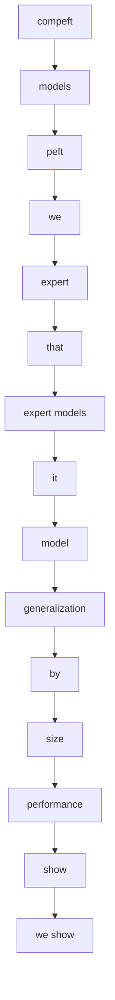

---

## 📄 [Bit Cipher -- A Simple yet Powerful Word Representation System that  Integrates Efficiently with Language Models](https://arxiv.org/abs/2311.11012)

**Authors:** Haoran Zhao and Jake Ryland Williams  
**Date:** ### 18 Nov 2023  
**Word Count (Title):** 16 | **Word Count (Summary):** 237  

**Links:** [Abstract](https://arxiv.org/abs/2311.11012)) | [PDF](https://arxiv.org/pdf/2311.11012).pdf)

**High Info Terms:** bit-cipher, while, word, that, we, embeddings, efficiency, experiments, training, classic, from, convergence, glove, word2vec, process  
**ROUGE Score:** 6.33%

### 🎤 TTF Read Aloud
- **Title:** [Bit Cipher -- A Simple yet Powerful Word Representation System that  Integrates Efficiently with Language Models](https://arxiv.org/abs/2311.11012)
- **Key Terms:** bit-cipher, while, word, that, we, embeddings, efficiency, experiments, training, classic, from, convergence, glove, word2vec, process
- **ROUGE:** 6.33%

#### Mermaid Graph of Key Concepts
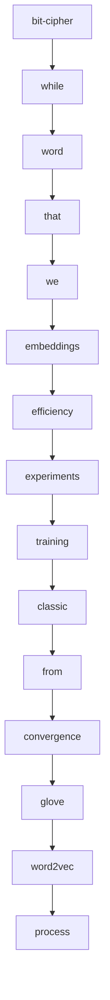

---

## 📄 [ConES: Concept Embedding Search for Parameter Efficient Tuning Large  Vision Language Models](https://arxiv.org/abs/2305.18993)

**Authors:** Huahui Yi, Ziyuan Qin, Wei Xu, Miaotian Guo, Kun Wang, Shaoting Zhang,  Kang Li, Qicheng Lao  
**Date:** ### 30 May 2023  
**Word Count (Title):** 12 | **Word Count (Summary):** 275  

**Links:** [Abstract](https://arxiv.org/abs/2305.18993)) | [PDF](https://arxiv.org/pdf/2305.18993).pdf)

**High Info Terms:** prompt, tuning, text, encoder, text encoder, methods, embeddings, approach, our, the text, can, by, is, we, as  
**ROUGE Score:** 5.45%

### 🎤 TTF Read Aloud
- **Title:** [ConES: Concept Embedding Search for Parameter Efficient Tuning Large  Vision Language Models](https://arxiv.org/abs/2305.18993)
- **Key Terms:** prompt, tuning, text, encoder, text encoder, methods, embeddings, approach, our, the text, can, by, is, we, as
- **ROUGE:** 5.45%

#### Mermaid Graph of Key Concepts
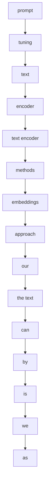

---

## 📄 [LeTI: Learning to Generate from Textual Interactions](https://arxiv.org/abs/2305.10314)

**Authors:** Xingyao Wang, Hao Peng, Reyhaneh Jabbarvand, Heng Ji  
**Date:** ### 17 May 2023  
**Word Count (Title):** 7 | **Word Count (Summary):** 279  

**Links:** [Abstract](https://arxiv.org/abs/2305.10314)) | [PDF](https://arxiv.org/pdf/2305.10314).pdf)

**High Info Terms:** feedback, leti, textual, code, language, lms, that, generation, natural, performance, textual feedback, outputs, from, we, binary  
**ROUGE Score:** 5.38%

### 🎤 TTF Read Aloud
- **Title:** [LeTI: Learning to Generate from Textual Interactions](https://arxiv.org/abs/2305.10314)
- **Key Terms:** feedback, leti, textual, code, language, lms, that, generation, natural, performance, textual feedback, outputs, from, we, binary
- **ROUGE:** 5.38%

#### Mermaid Graph of Key Concepts
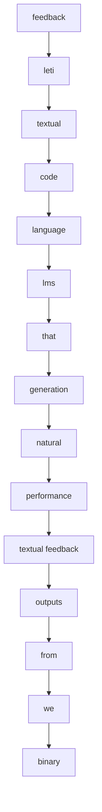

---

## 📄 [Polyhistor: Parameter-Efficient Multi-Task Adaptation for Dense Vision  Tasks](https://arxiv.org/abs/2210.03265)

**Authors:** Yen-Cheng Liu, Chih-Yao Ma, Junjiao Tian, Zijian He, Zsolt Kira  
**Date:** ### 07 Oct 2022  
**Word Count (Title):** 8 | **Word Count (Summary):** 207  

**Links:** [Abstract](https://arxiv.org/abs/2210.03265)) | [PDF](https://arxiv.org/pdf/2210.03265).pdf)

**High Info Terms:** tasks, methods, vision, fine-tuning, parameter-efficient, different, parameters, existing, vision tasks, while, transformers, this, trainable, different tasks, tasks with  
**ROUGE Score:** 7.25%

### 🎤 TTF Read Aloud
- **Title:** [Polyhistor: Parameter-Efficient Multi-Task Adaptation for Dense Vision  Tasks](https://arxiv.org/abs/2210.03265)
- **Key Terms:** tasks, methods, vision, fine-tuning, parameter-efficient, different, parameters, existing, vision tasks, while, transformers, this, trainable, different tasks, tasks with
- **ROUGE:** 7.25%

#### Mermaid Graph of Key Concepts
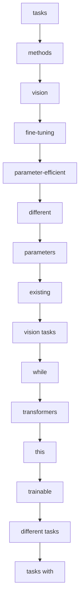

---

## 📄 [DSEE: Dually Sparsity-embedded Efficient Tuning of Pre-trained Language  Models](https://arxiv.org/abs/2111.00160)

**Authors:** Xuxi Chen, Tianlong Chen, Weizhu Chen, Ahmed Hassan Awadallah,  Zhangyang Wang, Yu Cheng  
**Date:** ### 24 May 2023  
**Word Count (Title):** 9 | **Word Count (Summary):** 239  

**Links:** [Abstract](https://arxiv.org/abs/2111.00160)) | [PDF](https://arxiv.org/pdf/2111.00160).pdf)

**High Info Terms:** by, pre-trained, models, fine-tuning, as, two, fine-tuned, model, dsee, language, starting, point, towards, downstream, pain  
**ROUGE Score:** 6.28%

### 🎤 TTF Read Aloud
- **Title:** [DSEE: Dually Sparsity-embedded Efficient Tuning of Pre-trained Language  Models](https://arxiv.org/abs/2111.00160)
- **Key Terms:** by, pre-trained, models, fine-tuning, as, two, fine-tuned, model, dsee, language, starting, point, towards, downstream, pain
- **ROUGE:** 6.28%

#### Mermaid Graph of Key Concepts
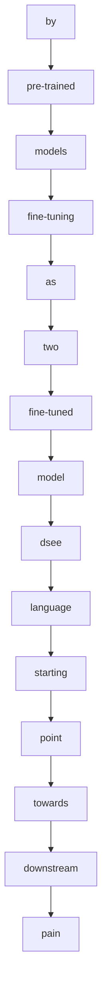

---

## 📄 [SPT: Semi-Parametric Prompt Tuning for Multitask Prompted Learning](https://arxiv.org/abs/2212.10929)

**Authors:** M Saiful Bari, Aston Zhang, Shuai Zheng, Xingjian Shi, Yi Zhu, Shafiq  Joty, Mu Li  
**Date:** ### 21 Dec 2022  
**Word Count (Title):** 8 | **Word Count (Summary):** 147  

**Links:** [Abstract](https://arxiv.org/abs/2212.10929)) | [PDF](https://arxiv.org/pdf/2212.10929).pdf)

**High Info Terms:** spt, fine-tuning, prompts, generalization, prompt, tuning, datasets, prompt tuning, language, can, multitask, prompted, learning, tasks, methods  
**ROUGE Score:** 10.2%

### 🎤 TTF Read Aloud
- **Title:** [SPT: Semi-Parametric Prompt Tuning for Multitask Prompted Learning](https://arxiv.org/abs/2212.10929)
- **Key Terms:** spt, fine-tuning, prompts, generalization, prompt, tuning, datasets, prompt tuning, language, can, multitask, prompted, learning, tasks, methods
- **ROUGE:** 10.2%

#### Mermaid Graph of Key Concepts
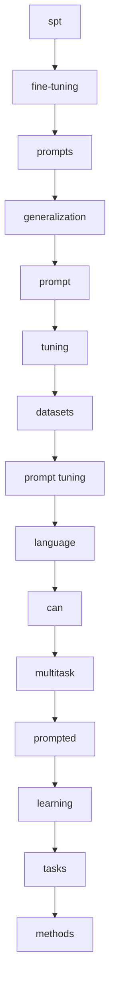

---

## 📄 [HyperTuning: Toward Adapting Large Language Models without  Back-propagation](https://arxiv.org/abs/2211.12485)

**Authors:** Jason Phang, Yi Mao, Pengcheng He, Weizhu Chen  
**Date:** ### 22 Nov 2022  
**Word Count (Title):** 8 | **Word Count (Summary):** 164  

**Links:** [Abstract](https://arxiv.org/abs/2211.12485)) | [PDF](https://arxiv.org/pdf/2211.12485).pdf)

**High Info Terms:** that, parameters, we, language, fine-tuning, large, tasks, can, hypertuning, model, hypermodel, generate, hypert5, parameters for, models  
**ROUGE Score:** 9.15%

### 🎤 TTF Read Aloud
- **Title:** [HyperTuning: Toward Adapting Large Language Models without  Back-propagation](https://arxiv.org/abs/2211.12485)
- **Key Terms:** that, parameters, we, language, fine-tuning, large, tasks, can, hypertuning, model, hypermodel, generate, hypert5, parameters for, models
- **ROUGE:** 9.15%

#### Mermaid Graph of Key Concepts
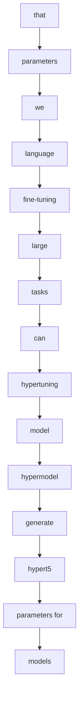

---
