Deep Research Evaluator:
https://huggingface.co/spaces/awacke1/DeepResearchEvaluator


With torch, transformers, and specialized fine tuning of small models 
1. We can build to specification of input dataset and 
2. Easily create RAG agents with fine tuned models using duckduckgo and smolagents.  
3. Show state of art SFT for agentic RAG to help manage models and gain ROI.


# Detailed Research Paper Summary


## 📄 [LiST: Lite Prompted Self-training Makes Parameter-Efficient Few-shot  Learners](https://arxiv.org/abs/2110.06274)

**Authors:** Yaqing Wang, Subhabrata Mukherjee, Xiaodong Liu, Jing Gao, Ahmed  Hassan Awadallah, Jianfeng Gao  
**Date:** ### 18 May 2022  
**Word Count (Title):** 8 | **Word Count (Summary):** 219  

**Links:** [Abstract](https://arxiv.org/abs/2110.06274)) | [PDF](https://arxiv.org/pdf/2110.06274).pdf)

**High Info Terms:** list, is, self-training, fine-tuning, parameters, we, few-shot, learning, over, that, prompt-based, fn, use, as, model  
**ROUGE Score:** 6.85%

### 🎤 TTF Read Aloud
- **Title:** [LiST: Lite Prompted Self-training Makes Parameter-Efficient Few-shot  Learners](https://arxiv.org/abs/2110.06274)
- **Key Terms:** list, is, self-training, fine-tuning, parameters, we, few-shot, learning, over, that, prompt-based, fn, use, as, model
- **ROUGE:** 6.85%

#### Mermaid Graph of Key Concepts
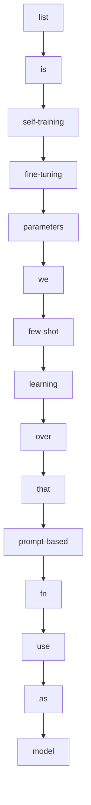

---


## 📄 [Composable Sparse Fine-Tuning for Cross-Lingual Transfer](https://arxiv.org/abs/2110.07560)

**Authors:** Alan Ansell, Edoardo Maria Ponti, Anna Korhonen, Ivan Vuli\'c  
**Date:** ### 09 Feb 2023  
**Word Count (Title):** 6 | **Word Count (Summary):** 218  

**Links:** [Abstract](https://arxiv.org/abs/2110.07560)) | [PDF](https://arxiv.org/pdf/2110.07560).pdf)

**High Info Terms:** fine-tuning, model, adapters, language, we, masks, sparse, be, both, in a, parameters, large, pretrained, transfer, prevent  
**ROUGE Score:** 6.88%

### 🎤 TTF Read Aloud
- **Title:** [Composable Sparse Fine-Tuning for Cross-Lingual Transfer](https://arxiv.org/abs/2110.07560)
- **Key Terms:** fine-tuning, model, adapters, language, we, masks, sparse, be, both, in a, parameters, large, pretrained, transfer, prevent
- **ROUGE:** 6.88%

#### Mermaid Graph of Key Concepts
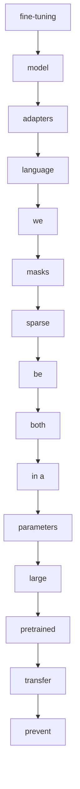

---


## 📄 [Efficient Fine-Tuning of Compressed Language Models with Learners](https://arxiv.org/abs/2208.02070)

**Authors:** Danilo Vucetic, Mohammadreza Tayaranian, Maryam Ziaeefard, James J.  Clark, Brett H. Meyer, Warren J. Gross  
**Date:** ### 03 Aug 2022  
**Word Count (Title):** 8 | **Word Count (Summary):** 131  

**Links:** [Abstract](https://arxiv.org/abs/2208.02070)) | [PDF](https://arxiv.org/pdf/2208.02070).pdf)

**High Info Terms:** fine-tuning, training, learners, models, works, learner, modules, methods, that, convergence, resource, utilization, by, parameters, learner modules  
**ROUGE Score:** 11.45%

### 🎤 TTF Read Aloud
- **Title:** [Efficient Fine-Tuning of Compressed Language Models with Learners](https://arxiv.org/abs/2208.02070)
- **Key Terms:** fine-tuning, training, learners, models, works, learner, modules, methods, that, convergence, resource, utilization, by, parameters, learner modules
- **ROUGE:** 11.45%

#### Mermaid Graph of Key Concepts
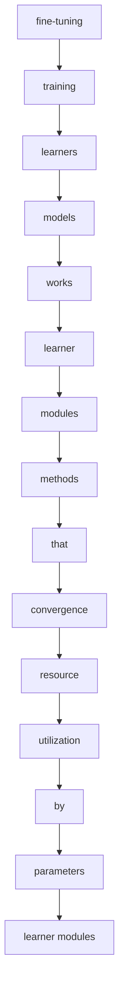

---


## 📄 [Task Adaptive Parameter Sharing for Multi-Task Learning](https://arxiv.org/abs/2203.16708)

**Authors:** Matthew Wallingford, Hao Li, Alessandro Achille, Avinash Ravichandran,  Charless Fowlkes, Rahul Bhotika, Stefano Soatto  
**Date:** ### 30 Mar 2022  
**Word Count (Title):** 7 | **Word Count (Summary):** 183  

**Links:** [Abstract](https://arxiv.org/abs/2203.16708)) | [PDF](https://arxiv.org/pdf/2203.16708).pdf)

**High Info Terms:** tasks, taps, model, downstream, task, base, task-specific, layers, while, downstream tasks, base model, models, learning, fine-tuning, is  
**ROUGE Score:** 8.2%

### 🎤 TTF Read Aloud
- **Title:** [Task Adaptive Parameter Sharing for Multi-Task Learning](https://arxiv.org/abs/2203.16708)
- **Key Terms:** tasks, taps, model, downstream, task, base, task-specific, layers, while, downstream tasks, base model, models, learning, fine-tuning, is
- **ROUGE:** 8.2%

#### Mermaid Graph of Key Concepts
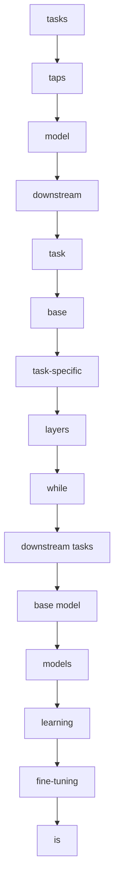

---


## 📄 [RAG vs Fine-tuning: Pipelines, Tradeoffs, and a Case Study on  Agriculture](https://arxiv.org/abs/2401.08406)

**Authors:** Angels Balaguer, Vinamra Benara, Renato Luiz de Freitas Cunha, Roberto  de M. Estev\~ao Filho, Todd Hendry, Daniel Holstein, Jennifer Marsman, Nick  Mecklenburg, Sara Malvar, Leonardo O. Nunes, Rafael Padilha, Morris Sharp,  Bruno Silva, Swati Sharma, Vijay Aski, Ranveer Chandra  
**Date:** ### 30 Jan 2024  
**Word Count (Title):** 11 | **Word Count (Summary):** 281  

**Links:** [Abstract](https://arxiv.org/abs/2401.08406)) | [PDF](https://arxiv.org/pdf/2401.08406).pdf)

**High Info Terms:** fine-tuning, we, rag, llms, pipeline, p, rag and, are, knowledge, model, our, from, results, and fine-tuning, which  
**ROUGE Score:** 5.34%

### 🎤 TTF Read Aloud
- **Title:** [RAG vs Fine-tuning: Pipelines, Tradeoffs, and a Case Study on  Agriculture](https://arxiv.org/abs/2401.08406)
- **Key Terms:** fine-tuning, we, rag, llms, pipeline, p, rag and, are, knowledge, model, our, from, results, and fine-tuning, which
- **ROUGE:** 5.34%

#### Mermaid Graph of Key Concepts
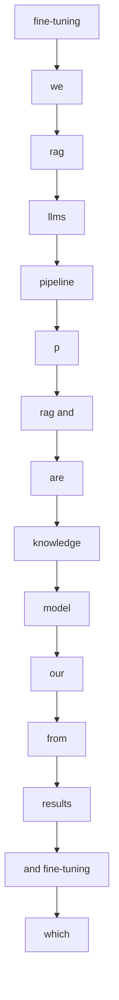

---


## 📄 [Scaling Sparse Fine-Tuning to Large Language Models](https://arxiv.org/abs/2401.16405)

**Authors:** Alan Ansell and Ivan Vuli\'c and Hannah Sterz and Anna Korhonen and  Edoardo M. Ponti  
**Date:** ### 02 Feb 2024  
**Word Count (Title):** 7 | **Word Count (Summary):** 219  

**Links:** [Abstract](https://arxiv.org/abs/2401.16405)) | [PDF](https://arxiv.org/pdf/2401.16405).pdf)

**High Info Terms:** we, their, llms, fine-tuning, spiel, parameters, sparse, terms, indices, deltas, sparse fine-tuning, in terms, terms of, parameter-efficient, methods  
**ROUGE Score:** 6.85%

### 🎤 TTF Read Aloud
- **Title:** [Scaling Sparse Fine-Tuning to Large Language Models](https://arxiv.org/abs/2401.16405)
- **Key Terms:** we, their, llms, fine-tuning, spiel, parameters, sparse, terms, indices, deltas, sparse fine-tuning, in terms, terms of, parameter-efficient, methods
- **ROUGE:** 6.85%

#### Mermaid Graph of Key Concepts
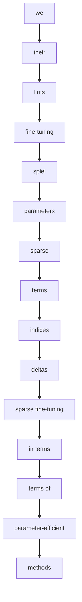

---


## 📄 [Exploring and Evaluating Personalized Models for Code Generation](https://arxiv.org/abs/2208.13928)

**Authors:** Andrei Zlotchevski, Dawn Drain, Alexey Svyatkovskiy, Colin Clement,  Neel Sundaresan, Michele Tufano  
**Date:** ### 20 Sep 2022  
**Word Count (Title):** 8 | **Word Count (Summary):** 226  

**Links:** [Abstract](https://arxiv.org/abs/2208.13928)) | [PDF](https://arxiv.org/pdf/2208.13928).pdf)

**High Info Terms:** model, fine-tuning, we, which, are, code, evaluate, parameters, large, transformer, modeling, learning, token, generalization, personalization  
**ROUGE Score:** 6.64%

### 🎤 TTF Read Aloud
- **Title:** [Exploring and Evaluating Personalized Models for Code Generation](https://arxiv.org/abs/2208.13928)
- **Key Terms:** model, fine-tuning, we, which, are, code, evaluate, parameters, large, transformer, modeling, learning, token, generalization, personalization
- **ROUGE:** 6.64%

#### Mermaid Graph of Key Concepts
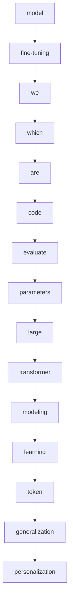

---


## 📄 [UniPT: Universal Parallel Tuning for Transfer Learning with Efficient  Parameter and Memory](https://arxiv.org/abs/2308.14316)

**Authors:** Haiwen Diao, Bo Wan, Ying Zhang, Xu Jia, Huchuan Lu, Long Chen  
**Date:** ### 28 Aug 2023  
**Word Count (Title):** 12 | **Word Count (Summary):** 225  

**Links:** [Abstract](https://arxiv.org/abs/2308.14316)) | [PDF](https://arxiv.org/pdf/2308.14316).pdf)

**High Info Terms:** petl, unipt, pre-trained, methods, we, parallel, that, petl methods, achieve, performance, tasks, parameters, networks, is, transfer  
**ROUGE Score:** 6.67%

### 🎤 TTF Read Aloud
- **Title:** [UniPT: Universal Parallel Tuning for Transfer Learning with Efficient  Parameter and Memory](https://arxiv.org/abs/2308.14316)
- **Key Terms:** petl, unipt, pre-trained, methods, we, parallel, that, petl methods, achieve, performance, tasks, parameters, networks, is, transfer
- **ROUGE:** 6.67%

#### Mermaid Graph of Key Concepts
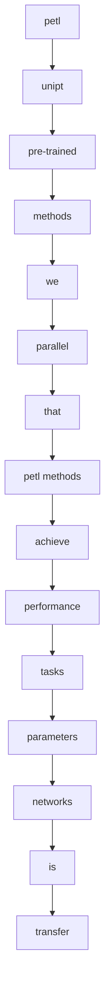

---


## 📄 [Weaver: Foundation Models for Creative Writing](https://arxiv.org/abs/2401.17268)

**Authors:** Tiannan Wang, Jiamin Chen, Qingrui Jia, Shuai Wang, Ruoyu Fang, Huilin  Wang, Zhaowei Gao, Chunzhao Xie, Chuou Xu, Jihong Dai, Yibin Liu, Jialong Wu,  Shengwei Ding, Long Li, Zhiwei Huang, Xinle Deng, Teng Yu, Gangan Ma, Han  Xiao, Zixin Chen, Danjun Xiang, Yunxia Wang, Yuanyuan Zhu, Yi Xiao, Jing  Wang, Yiru Wang, Siran Ding, Jiayang Huang, Jiayi Xu, Yilihamu Tayier, Zhenyu  Hu, Yuan Gao, Chengfeng Zheng, Yueshu Ye, Yihang Li, Lei Wan, Xinyue Jiang,  Yujie Wang, Siyu Cheng, Zhule Song, Xiangru Tang, Xiaohua Xu, Ningyu Zhang,  Huajun Chen, Yuchen Eleanor Jiang, and Wangchunshu Zhou  
**Date:** ### 30 Jan 2024  
**Word Count (Title):** 6 | **Word Count (Summary):** 237  

**Links:** [Abstract](https://arxiv.org/abs/2401.17268)) | [PDF](https://arxiv.org/pdf/2401.17268).pdf)

**High Info Terms:** weaver, writing, llms, models, we, our, family, large, language, content, creation, carefully, improving, capabilities, professional  
**ROUGE Score:** 6.33%

### 🎤 TTF Read Aloud
- **Title:** [Weaver: Foundation Models for Creative Writing](https://arxiv.org/abs/2401.17268)
- **Key Terms:** weaver, writing, llms, models, we, our, family, large, language, content, creation, carefully, improving, capabilities, professional
- **ROUGE:** 6.33%

#### Mermaid Graph of Key Concepts
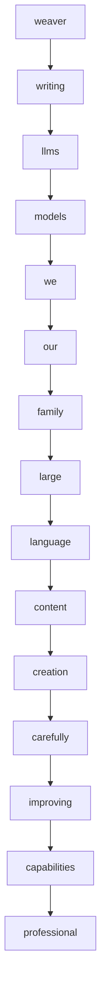

---


## 📄 [PERFECT: Prompt-free and Efficient Few-shot Learning with Language  Models](https://arxiv.org/abs/2204.01172)

**Authors:** Rabeeh Karimi Mahabadi, Luke Zettlemoyer, James Henderson, Marzieh  Saeidi, Lambert Mathias, Veselin Stoyanov, and Majid Yazdani  
**Date:** ### 26 Apr 2022  
**Word Count (Title):** 9 | **Word Count (Summary):** 184  

**Links:** [Abstract](https://arxiv.org/abs/2204.01172)) | [PDF](https://arxiv.org/pdf/2204.01172).pdf)

**High Info Terms:** few-shot, fine-tuning, that, perfect, we, which, methods, plms, engineered, prompts, verbalizers, new, task, can, simple  
**ROUGE Score:** 8.15%

### 🎤 TTF Read Aloud
- **Title:** [PERFECT: Prompt-free and Efficient Few-shot Learning with Language  Models](https://arxiv.org/abs/2204.01172)
- **Key Terms:** few-shot, fine-tuning, that, perfect, we, which, methods, plms, engineered, prompts, verbalizers, new, task, can, simple
- **ROUGE:** 8.15%

#### Mermaid Graph of Key Concepts
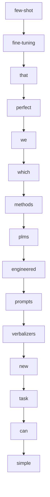

---


## 📄 [AdaMix: Mixture-of-Adaptations for Parameter-efficient Model Tuning](https://arxiv.org/abs/2205.12410)

**Authors:** Yaqing Wang, Sahaj Agarwal, Subhabrata Mukherjee, Xiaodong Liu, Jing  Gao, Ahmed Hassan Awadallah, Jianfeng Gao  
**Date:** ### 02 Nov 2022  
**Word Count (Title):** 6 | **Word Count (Summary):** 191  

**Links:** [Abstract](https://arxiv.org/abs/2205.12410)) | [PDF](https://arxiv.org/pdf/2205.12410).pdf)

**High Info Terms:** fine-tuning, peft, plm, adamix, tasks, parameters, we, method, that, mixture, the plm, peft method, a mixture, mixture of, large  
**ROUGE Score:** 7.85%

### 🎤 TTF Read Aloud
- **Title:** [AdaMix: Mixture-of-Adaptations for Parameter-efficient Model Tuning](https://arxiv.org/abs/2205.12410)
- **Key Terms:** fine-tuning, peft, plm, adamix, tasks, parameters, we, method, that, mixture, the plm, peft method, a mixture, mixture of, large
- **ROUGE:** 7.85%

#### Mermaid Graph of Key Concepts
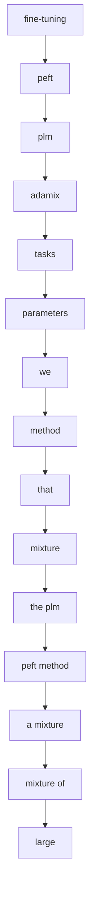

---


## 📄 [AdaMix: Mixture-of-Adaptations for Parameter-efficient Model Tuning](https://arxiv.org/abs/2210.17451)

**Authors:** Yaqing Wang, Sahaj Agarwal, Subhabrata Mukherjee, Xiaodong Liu, Jing  Gao, Ahmed Hassan Awadallah, Jianfeng Gao  
**Date:** ### 02 Nov 2022  
**Word Count (Title):** 6 | **Word Count (Summary):** 191  

**Links:** [Abstract](https://arxiv.org/abs/2210.17451)) | [PDF](https://arxiv.org/pdf/2210.17451).pdf)

**High Info Terms:** fine-tuning, peft, plm, adamix, tasks, parameters, we, method, that, mixture, the plm, peft method, a mixture, mixture of, large  
**ROUGE Score:** 7.85%

### 🎤 TTF Read Aloud
- **Title:** [AdaMix: Mixture-of-Adaptations for Parameter-efficient Model Tuning](https://arxiv.org/abs/2210.17451)
- **Key Terms:** fine-tuning, peft, plm, adamix, tasks, parameters, we, method, that, mixture, the plm, peft method, a mixture, mixture of, large
- **ROUGE:** 7.85%

#### Mermaid Graph of Key Concepts


---


## 📄 [ComPEFT: Compression for Communicating Parameter Efficient Updates via  Sparsification and Quantization](https://arxiv.org/abs/2311.13171)

**Authors:** Prateek Yadav, Leshem Choshen, Colin Raffel, Mohit Bansal  
**Date:** ### 22 Nov 2023  
**Word Count (Title):** 11 | **Word Count (Summary):** 247  

**Links:** [Abstract](https://arxiv.org/abs/2311.13171)) | [PDF](https://arxiv.org/pdf/2311.13171).pdf)

**High Info Terms:** compeft, models, peft, we, expert, that, expert models, it, model, generalization, by, size, performance, show, we show  
**ROUGE Score:** 6.07%

### 🎤 TTF Read Aloud
- **Title:** [ComPEFT: Compression for Communicating Parameter Efficient Updates via  Sparsification and Quantization](https://arxiv.org/abs/2311.13171)
- **Key Terms:** compeft, models, peft, we, expert, that, expert models, it, model, generalization, by, size, performance, show, we show
- **ROUGE:** 6.07%

#### Mermaid Graph of Key Concepts
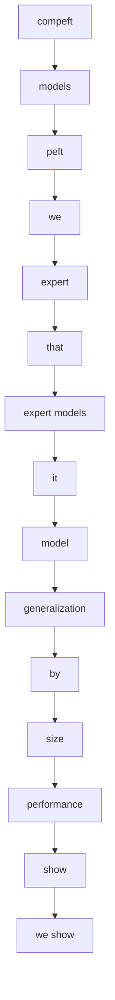

---


## 📄 [Bit Cipher -- A Simple yet Powerful Word Representation System that  Integrates Efficiently with Language Models](https://arxiv.org/abs/2311.11012)

**Authors:** Haoran Zhao and Jake Ryland Williams  
**Date:** ### 18 Nov 2023  
**Word Count (Title):** 16 | **Word Count (Summary):** 237  

**Links:** [Abstract](https://arxiv.org/abs/2311.11012)) | [PDF](https://arxiv.org/pdf/2311.11012).pdf)

**High Info Terms:** bit-cipher, while, word, that, we, embeddings, efficiency, experiments, training, classic, from, convergence, glove, word2vec, process  
**ROUGE Score:** 6.33%

### 🎤 TTF Read Aloud
- **Title:** [Bit Cipher -- A Simple yet Powerful Word Representation System that  Integrates Efficiently with Language Models](https://arxiv.org/abs/2311.11012)
- **Key Terms:** bit-cipher, while, word, that, we, embeddings, efficiency, experiments, training, classic, from, convergence, glove, word2vec, process
- **ROUGE:** 6.33%

#### Mermaid Graph of Key Concepts
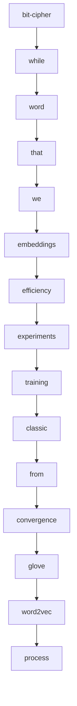

---


## 📄 [ConES: Concept Embedding Search for Parameter Efficient Tuning Large  Vision Language Models](https://arxiv.org/abs/2305.18993)

**Authors:** Huahui Yi, Ziyuan Qin, Wei Xu, Miaotian Guo, Kun Wang, Shaoting Zhang,  Kang Li, Qicheng Lao  
**Date:** ### 30 May 2023  
**Word Count (Title):** 12 | **Word Count (Summary):** 275  

**Links:** [Abstract](https://arxiv.org/abs/2305.18993)) | [PDF](https://arxiv.org/pdf/2305.18993).pdf)

**High Info Terms:** prompt, tuning, text, encoder, text encoder, methods, embeddings, approach, our, the text, can, by, is, we, as  
**ROUGE Score:** 5.45%

### 🎤 TTF Read Aloud
- **Title:** [ConES: Concept Embedding Search for Parameter Efficient Tuning Large  Vision Language Models](https://arxiv.org/abs/2305.18993)
- **Key Terms:** prompt, tuning, text, encoder, text encoder, methods, embeddings, approach, our, the text, can, by, is, we, as
- **ROUGE:** 5.45%

#### Mermaid Graph of Key Concepts
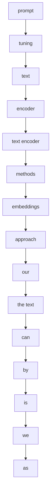

---


## 📄 [LeTI: Learning to Generate from Textual Interactions](https://arxiv.org/abs/2305.10314)

**Authors:** Xingyao Wang, Hao Peng, Reyhaneh Jabbarvand, Heng Ji  
**Date:** ### 17 May 2023  
**Word Count (Title):** 7 | **Word Count (Summary):** 279  

**Links:** [Abstract](https://arxiv.org/abs/2305.10314)) | [PDF](https://arxiv.org/pdf/2305.10314).pdf)

**High Info Terms:** feedback, leti, textual, code, language, lms, that, generation, natural, performance, textual feedback, outputs, from, we, binary  
**ROUGE Score:** 5.38%

### 🎤 TTF Read Aloud
- **Title:** [LeTI: Learning to Generate from Textual Interactions](https://arxiv.org/abs/2305.10314)
- **Key Terms:** feedback, leti, textual, code, language, lms, that, generation, natural, performance, textual feedback, outputs, from, we, binary
- **ROUGE:** 5.38%

#### Mermaid Graph of Key Concepts
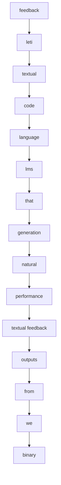

---


## 📄 [Polyhistor: Parameter-Efficient Multi-Task Adaptation for Dense Vision  Tasks](https://arxiv.org/abs/2210.03265)

**Authors:** Yen-Cheng Liu, Chih-Yao Ma, Junjiao Tian, Zijian He, Zsolt Kira  
**Date:** ### 07 Oct 2022  
**Word Count (Title):** 8 | **Word Count (Summary):** 207  

**Links:** [Abstract](https://arxiv.org/abs/2210.03265)) | [PDF](https://arxiv.org/pdf/2210.03265).pdf)

**High Info Terms:** tasks, methods, vision, fine-tuning, parameter-efficient, different, parameters, existing, vision tasks, while, transformers, this, trainable, different tasks, tasks with  
**ROUGE Score:** 7.25%

### 🎤 TTF Read Aloud
- **Title:** [Polyhistor: Parameter-Efficient Multi-Task Adaptation for Dense Vision  Tasks](https://arxiv.org/abs/2210.03265)
- **Key Terms:** tasks, methods, vision, fine-tuning, parameter-efficient, different, parameters, existing, vision tasks, while, transformers, this, trainable, different tasks, tasks with
- **ROUGE:** 7.25%

#### Mermaid Graph of Key Concepts
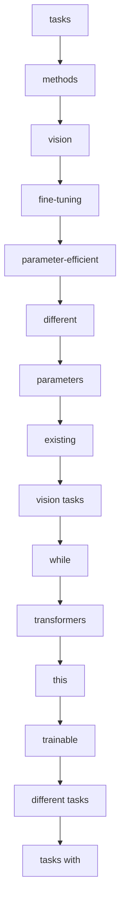

---


## 📄 [DSEE: Dually Sparsity-embedded Efficient Tuning of Pre-trained Language  Models](https://arxiv.org/abs/2111.00160)

**Authors:** Xuxi Chen, Tianlong Chen, Weizhu Chen, Ahmed Hassan Awadallah,  Zhangyang Wang, Yu Cheng  
**Date:** ### 24 May 2023  
**Word Count (Title):** 9 | **Word Count (Summary):** 239  

**Links:** [Abstract](https://arxiv.org/abs/2111.00160)) | [PDF](https://arxiv.org/pdf/2111.00160).pdf)

**High Info Terms:** by, pre-trained, models, fine-tuning, as, two, fine-tuned, model, dsee, language, starting, point, towards, downstream, pain  
**ROUGE Score:** 6.28%

### 🎤 TTF Read Aloud
- **Title:** [DSEE: Dually Sparsity-embedded Efficient Tuning of Pre-trained Language  Models](https://arxiv.org/abs/2111.00160)
- **Key Terms:** by, pre-trained, models, fine-tuning, as, two, fine-tuned, model, dsee, language, starting, point, towards, downstream, pain
- **ROUGE:** 6.28%

#### Mermaid Graph of Key Concepts
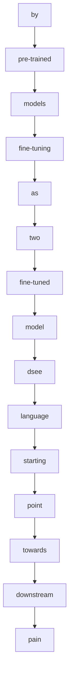

---


## 📄 [SPT: Semi-Parametric Prompt Tuning for Multitask Prompted Learning](https://arxiv.org/abs/2212.10929)

**Authors:** M Saiful Bari, Aston Zhang, Shuai Zheng, Xingjian Shi, Yi Zhu, Shafiq  Joty, Mu Li  
**Date:** ### 21 Dec 2022  
**Word Count (Title):** 8 | **Word Count (Summary):** 147  

**Links:** [Abstract](https://arxiv.org/abs/2212.10929)) | [PDF](https://arxiv.org/pdf/2212.10929).pdf)

**High Info Terms:** spt, fine-tuning, prompts, generalization, prompt, tuning, datasets, prompt tuning, language, can, multitask, prompted, learning, tasks, methods  
**ROUGE Score:** 10.2%

### 🎤 TTF Read Aloud
- **Title:** [SPT: Semi-Parametric Prompt Tuning for Multitask Prompted Learning](https://arxiv.org/abs/2212.10929)
- **Key Terms:** spt, fine-tuning, prompts, generalization, prompt, tuning, datasets, prompt tuning, language, can, multitask, prompted, learning, tasks, methods
- **ROUGE:** 10.2%

#### Mermaid Graph of Key Concepts
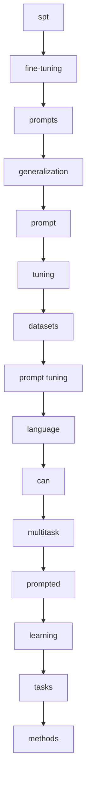

---


## 📄 [HyperTuning: Toward Adapting Large Language Models without  Back-propagation](https://arxiv.org/abs/2211.12485)

**Authors:** Jason Phang, Yi Mao, Pengcheng He, Weizhu Chen  
**Date:** ### 22 Nov 2022  
**Word Count (Title):** 8 | **Word Count (Summary):** 164  

**Links:** [Abstract](https://arxiv.org/abs/2211.12485)) | [PDF](https://arxiv.org/pdf/2211.12485).pdf)

**High Info Terms:** that, parameters, we, language, fine-tuning, large, tasks, can, hypertuning, model, hypermodel, generate, hypert5, parameters for, models  
**ROUGE Score:** 9.15%

### 🎤 TTF Read Aloud
- **Title:** [HyperTuning: Toward Adapting Large Language Models without  Back-propagation](https://arxiv.org/abs/2211.12485)
- **Key Terms:** that, parameters, we, language, fine-tuning, large, tasks, can, hypertuning, model, hypermodel, generate, hypert5, parameters for, models
- **ROUGE:** 9.15%

#### Mermaid Graph of Key Concepts
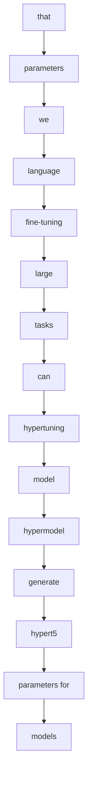

---
```html
<!DOCTYPE html>
<html lang="en">
<head>
    <meta charset="UTF-8">
    <meta name="viewport" content="width=device-width, initial-scale=1.0">
    <title>AI Architecture Modeler</title>
    <script src="https://cdn.tailwindcss.com"></script>
    <link rel="preconnect" href="https://fonts.googleapis.com">
    <link rel="preconnect" href="https://fonts.gstatic.com" crossorigin>
    <link href="https://fonts.googleapis.com/css2?family=Inter:wght@400;500;600;700&display=swap" rel="stylesheet">
    <style>
        body {
            font-family: 'Inter', sans-serif;
            overscroll-behavior: none;
        }
        .shape {
            cursor: move;
            user-select: none;
        }
        .shape-text, .shape-subtext, .shape-domain-text, .shape-mfa-text {
            pointer-events: none;
            user-select: none;
            font-size: 10px;
            font-weight: 500;
        }
         .shape-title {
            pointer-events: none;
            user-select: none;
            font-size: 12px;
            font-weight: 700;
        }
        .network-zone-title {
            pointer-events: none;
            font-size: 14px;
            font-weight: 600;
        }
        #canvas-svg {
            touch-action: none;
        }
        .connector-line, .connector-hitbox {
            stroke-width: 10;
            stroke-linecap: round;
            stroke: transparent;
            cursor: pointer;
        }
        .connector-line-visible {
             stroke-width: 2.5;
             stroke: #9ca3af; /* gray-400 */
             pointer-events: none;
        }
        .selected-connector .connector-line-visible {
            stroke: #3b82f6; /* blue-500 */
            stroke-width: 3.5;
        }
        .connector-label {
            font-size: 10px;
            font-weight: 600;
            fill: #374151; /* gray-700 */
            paint-order: stroke;
            stroke: #ffffff;
            stroke-width: 3px;
            stroke-linecap: butt;
            stroke-linejoin: miter;
        }
        .resize-handle, .connector-handle {
            fill: #3b82f6; /* blue-500 */
            stroke: white;
            stroke-width: 2px;
        }
        .resize-handle.tl, .resize-handle.br { cursor: nwse-resize; }
        .resize-handle.tr, .resize-handle.bl { cursor: nesw-resize; }
        .connector-handle { cursor: grab; }
        .connector-handle:active { cursor: grabbing; }

        #sidebar-editor input, #sidebar-editor textarea, #sidebar-editor select {
            @apply w-full bg-gray-100 border border-gray-300 rounded-md px-2 py-1 text-sm focus:outline-none focus:ring-2 focus:ring-indigo-500;
        }
         #sidebar-editor label {
            @apply text-xs font-medium text-gray-600;
        }
        .property-grid {
            display: grid;
            grid-template-columns: 1fr auto;
            align-items: center;
            gap: 0.5rem;
        }
        #selection-box {
            fill: rgba(59, 130, 246, 0.2);
            stroke: rgba(59, 130, 246, 0.8);
            stroke-width: 1;
            stroke-dasharray: 4 2;
        }
    </style>
</head>
<body class="bg-gray-100 flex flex-col h-screen antialiased">

    <header class="bg-white shadow-md p-4 z-20">
        <div class="container mx-auto flex justify-between items-center">
            <h1 class="text-xl font-bold text-gray-800 flex items-center gap-2">
                <svg xmlns="http://www.w3.org/2000/svg" width="24" height="24" viewBox="0 0 24 24" fill="none" stroke="currentColor" stroke-width="2" stroke-linecap="round" stroke-linejoin="round" class="text-indigo-600"><path d="M12 2L2 7l10 5 10-5-10-5z"></path><path d="M2 17l10 5 10-5"></path><path d="M2 12l10 5 10-5"></path></svg>
                AI Architecture Modeler
            </h1>
        </div>
    </header>

    <div class="flex flex-1 overflow-hidden">
        <aside class="w-72 bg-white p-4 shadow-lg overflow-y-auto z-10 flex flex-col">
            <h2 class="text-lg font-semibold text-gray-700 border-b pb-2">Components</h2>
            <div id="component-buttons-container" class="grid grid-cols-2 gap-2 mt-4"></div>

            <div class="mt-auto space-y-2 pt-4 border-t">
                 <button id="connect-btn" class="w-full bg-gray-600 hover:bg-gray-700 text-white font-bold py-2 px-4 rounded-lg transition-colors duration-200">Connect</button>
                 <button id="download-png-btn" class="w-full bg-orange-500 hover:bg-orange-600 text-white font-bold py-2 px-4 rounded-lg transition-colors duration-200">Download Image</button>
                 <button id="save-btn" class="w-full bg-green-600 hover:bg-green-700 text-white font-bold py-2 px-4 rounded-lg transition-colors duration-200">Save Diagram</button>
                 <button id="load-btn" class="w-full bg-blue-600 hover:bg-blue-700 text-white font-bold py-2 px-4 rounded-lg transition-colors duration-200">Load Diagram</button>
                 <button id="clear-btn" class="w-full bg-red-600 hover:bg-red-700 text-white font-bold py-2 px-4 rounded-lg transition-colors duration-200">Clear Canvas</button>
            </div>
        </aside>

        <main class="flex-1 bg-gray-200 p-4">
            <div id="canvas-container" class="w-full h-full bg-white rounded-lg shadow-inner overflow-hidden relative">
                <svg id="canvas-svg" class="w-full h-full"></svg>
                <div id="temp-line-container" style="position: absolute; top: 0; left: 0; pointer-events: none; width: 100%; height: 100%; overflow: hidden;">
                    <svg id="temp-line-svg" width="100%" height="100%"></svg>
                </div>
            </div>
        </main>

        <aside id="sidebar-editor" class="w-96 bg-white p-4 shadow-lg overflow-y-auto z-10 border-l">
             <h2 class="text-lg font-semibold text-gray-700 border-b pb-2 mb-4">Properties</h2>
             <div id="editor-content" class="space-y-3">
                <p class="text-sm text-gray-500 text-center italic">Select an item to edit its properties.</p>
             </div>
        </aside>
    </div>
    
    <input type="file" id="file-input" class="hidden" accept=".json">

    <script>
        // --- DOM Element References ---
        const canvasContainer = document.getElementById('canvas-container');
        const svg = document.getElementById('canvas-svg');
        const componentButtonsContainer = document.getElementById('component-buttons-container');
        const connectBtn = document.getElementById('connect-btn');
        const clearBtn = document.getElementById('clear-btn');
        const saveBtn = document.getElementById('save-btn');
        const loadBtn = document.getElementById('load-btn');
        const downloadPngBtn = document.getElementById('download-png-btn');
        const fileInput = document.getElementById('file-input');
        const sidebarEditor = document.getElementById('sidebar-editor');
        const editorContent = document.getElementById('editor-content');
        const tempLineSvg = document.getElementById('temp-line-svg');

        // --- State Management ---
        let shapes = [];
        let connectors = [];
        let isDragging = false;
        let isConnecting = false;
        let isResizing = false;
        let isSelecting = false;
        let isDraggingConnectorHandle = false;
        let draggedShape = null;
        let connectionStartShape = null;
        let selectedItems = [];
        let draggedConnectorInfo = { handle: null, conn: null, end: null };
        let offset = { x: 0, y: 0 };
        let selectionBox = { x1: 0, y1: 0, x2: 0, y2: 0 };

        // --- Component Definitions ---
        const componentDefs = {
            'networkZone': {
                label: 'Network Zone', color: 'bg-gray-200', icon: '🌐',
                properties: { name: 'domain.com', color: 'blue' },
                isZone: true,
                resizable: true,
                colors: { blue: 'fill-blue-100', green: 'fill-green-100', red: 'fill-red-100', yellow: 'fill-yellow-100', purple: 'fill-purple-100', pink: 'fill-pink-100', teal: 'fill-teal-100' }
            },
            'users': {
                label: 'Users', color: 'bg-pink-500', icon: '👤',
                properties: { role: 'User', group: 'Service' }
            },
            'webApp': {
                label: 'Web App', color: 'bg-blue-500', icon: '💻',
                properties: { name: 'My Web App', url: 'app.example.com' }
            },
            'firewall': {
                label: 'Firewall', color: 'bg-orange-600', icon: '🏢🔒',
                properties: { policy: 'Default Deny', network: 'Perimeter' }
            },
            'script': {
                label: 'Script', color: 'bg-yellow-400', icon: '�',
                properties: { name: 'deploy.ps1', targetZone: 'prod-net', mapsDrive: 'W:' }
            },
            'github': { 
                label: 'Github', color: 'bg-gray-800', icon: '🐈', 
                properties: { url: 'github.com/repo', network: 'MS' } 
            },
            'serviceTool': { 
                label: 'Service Tool', color: 'bg-cyan-600', icon: '🔧', 
                properties: { name: 'ServiceNow', domainLabel: 'Intranet', domain: 'tenant.com', id: '1', orgLabel: 'Client', url: 'service-now.com' } 
            },
            'vm': { 
                label: 'Virtual Machine', color: 'bg-orange-500', icon: '🖥️', 
                properties: { type: 'VMWare', mfa: 'Azure MFA', authSet: 'RDP, Vault', hosts: 'wn, wp', networkId: 'MS 1' } 
            },
            'passwordVault': { 
                label: 'Password Vault', color: 'bg-yellow-500', icon: '🔐', 
                properties: { mfa: 'Azure MFA', url: 'vault.example.com', authDomain1: 'MS 1', authDomain2: 'MS 2' } 
            },
            'serverProd': { 
                label: 'Server (PROD)', color: 'bg-red-700', icon: '🔩', 
                properties: { env: 'PROD', fqdn: 'prod.server.com', os: 'WINS2022', authId: 'MS 2 with Key', path: 'E:\\' } 
            },
            'serverNonProd': { 
                label: 'Server (Non-Prod)', color: 'bg-blue-700', icon: '🔩', 
                properties: { env: 'Non-Prod', fqdn: 'dev.server.com', os: 'WINS2022', authId: 'MS 2 with Key', path: 'E:\\' } 
            },
            'driveMap': {
                label: 'Drive Map', color: 'bg-indigo-500', icon: '🚗',
                properties: { driveLetter: 'W:', server: 'Server1.domain.com', script: './Map_Drives.ps1' }
            },
            'aiApi': { 
                label: 'AI API', color: 'bg-sky-500', icon: '🧠🌐', 
                properties: { name: 'My API', apiType: 'Azure OpenAI', model: 'GPT-4o', auth: 'URL, Key, App Reg on MS 1' },
                options: { apiType: ['Azure OpenAI', 'FastAPI', 'Custom'] }
            },
            'aiClient': { 
                label: 'AI Client', color: 'bg-sky-600', icon: '🤖🧠', 
                properties: { name: 'App Client', clientType: 'Azure OpenAI Client', library: 'Azure.AI.OpenAI' },
                options: { clientType: ['Azure OpenAI Client', 'LangChain', 'Custom'] }
            },
            'aiAgent': {
                label: 'AI Agent', color: 'bg-teal-600', icon: '🤖',
                properties: { name: 'My Agent', agentType: 'Autonomous', task: 'Data Analysis' },
                options: { agentType: ['Autonomous', 'Tool-Using', 'Human-in-the-loop'] }
            },
            'pim': { 
                label: 'PIM', color: 'bg-purple-600', icon: '👑', 
                properties: { name: 'OC2', url: 'pim.example.com' } 
            },
            'fileShare': { 
                label: 'File Share', color: 'bg-green-600', icon: '📂', 
                properties: { name: 'NFS File Dock', pathList: '/1, /2, /3, /3/Outbound', domain: 'domain.com 1' } 
            },
            'fileShareOutbound': { 
                label: 'File Share (Out)', color: 'bg-green-700', icon: '📤', 
                properties: { name: 'NFS File Dock', path: '/3/Outbound', domain: 'domain.com 1' } 
            },
            'pngFile': { 
                label: 'PNG Image', color: 'bg-lime-500', icon: '🖼️', 
                properties: { name: 'image.png', "Orientation": "Portrait", "Page Count": "2" } 
            },
            'pdfFile': { 
                label: 'PDF Document', color: 'bg-red-500', icon: '📄', 
                properties: { name: 'Summary Output.pdf', "Volume Per Month": "30,000", "Avg Pages Per Doc": "140", "Number of Documents in Set": "80" } 
            },
            'fullTextMdFile': { 
                label: 'FullText MD', color: 'bg-gray-500', icon: '📝', 
                properties: { name: '_Fulltext.md', pages: 2500 } 
            },
            'summaryMdFile': { 
                label: 'Summary MD', color: 'bg-gray-600', icon: '✨', 
                properties: { name: 'summary.md', source: 'article.md' } 
            },
            'knowledgeTemplateFile': { 
                label: 'Knowledge File', color: 'bg-fuchsia-600', icon: '🧠', 
                properties: { name: 'Template.txt', Type: 'Summary Markdown Template' } 
            },
        };

        // --- Core Functions ---

        function getPropertyEmoji(key) {
            const lowerKey = key.toLowerCase();
            if (lowerKey.includes('url') || lowerKey.includes('fqdn')) return '🌎';
            if (lowerKey.includes('mfa')) return '🔒';
            if (lowerKey.includes('path') || lowerKey.includes('script')) return '📁';
            if (lowerKey.includes('key') || lowerKey.includes('auth')) return '🔑';
            if (lowerKey.includes('os')) return '💻';
            if (lowerKey.includes('id')) return '🆔';
            if (lowerKey.includes('name')) return '🏷️';
            if (lowerKey.includes('role') || lowerKey.includes('group')) return '👥';
            if (lowerKey.includes('model') || lowerKey.includes('schema') || lowerKey.includes('type')) return '🧠';
            if (lowerKey.includes('size') || lowerKey.includes('pages') || lowerKey.includes('words') || lowerKey.includes('volume') || lowerKey.includes('count')) return '🔢';
            return '▪️';
        }

        function calculateShapeHeight(shape) {
            const def = componentDefs[shape.type];
            if (def.isZone) return shape.height; 

            let visibleProperties = 0;
            for (const key in shape.properties) {
                if (!(shape.hideInShape && shape.hideInShape[key])) {
                    visibleProperties++;
                }
            }

            const baseHeight = 35; 
            const propertiesHeight = visibleProperties * 12;
            let bottomTextCount = 0;
            if (shape.properties.domain || shape.properties.networkId || shape.properties.network) bottomTextCount++;
            if (shape.properties.mfa) bottomTextCount++;
            const bottomTextHeight = bottomTextCount * 12;
            const padding = 15;

            return baseHeight + propertiesHeight + bottomTextHeight + padding;
        }

        function render() {
            svg.innerHTML = ''; 
            
            const zones = shapes.filter(s => componentDefs[s.type].isZone);
            const regularShapes = shapes.filter(s => !componentDefs[s.type].isZone);

            const zonesGroup = document.createElementNS('http://www.w3.org/2000/svg', 'g');
            zones.forEach(shape => renderShape(shape, zonesGroup));
            svg.appendChild(zonesGroup);

            const connectorsGroup = document.createElementNS('http://www.w3.org/2000/svg', 'g');
            connectors.forEach(conn => renderConnector(conn, connectorsGroup));
            svg.appendChild(connectorsGroup);

            const shapesGroup = document.createElementNS('http://www.w3.org/2000/svg', 'g');
            regularShapes.forEach(shape => renderShape(shape, shapesGroup));
            svg.appendChild(shapesGroup);

            const selectionGroup = document.createElementNS('http://www.w3.org/2000/svg', 'g');
            if (selectedItems.length > 0) {
                selectedItems.forEach(item => {
                    if (item.type && componentDefs[item.type].resizable) {
                        renderResizeHandles(item, selectionGroup);
                    }
                });
            } else if (selectedItems.length === 1 && selectedItems[0].from) {
                renderConnectorHandles(selectedItems[0], selectionGroup);
            }

            if (isSelecting) {
                const box = document.createElementNS('http://www.w3.org/2000/svg', 'rect');
                box.setAttribute('id', 'selection-box');
                box.setAttribute('x', Math.min(selectionBox.x1, selectionBox.x2));
                box.setAttribute('y', Math.min(selectionBox.y1, selectionBox.y2));
                box.setAttribute('width', Math.abs(selectionBox.x1 - selectionBox.x2));
                box.setAttribute('height', Math.abs(selectionBox.y1 - selectionBox.y2));
                selectionGroup.appendChild(box);
            }
            svg.appendChild(selectionGroup);
        }

        function renderConnector(conn, parent) {
            const fromShape = shapes.find(s => s.id === conn.from);
            const toShape = shapes.find(s => s.id === conn.to);
            if (!fromShape || !toShape) return;

            const group = document.createElementNS('http://www.w3.org/2000/svg', 'g');
            group.setAttribute('data-id', conn.id);
            if(selectedItems.some(item => item.id === conn.id)) {
                group.classList.add('selected-connector');
            }

            const lineHitbox = document.createElementNS('http://www.w3.org/2000/svg', 'line');
            lineHitbox.setAttribute('x1', fromShape.x);
            lineHitbox.setAttribute('y1', fromShape.y);
            lineHitbox.setAttribute('x2', toShape.x);
            lineHitbox.setAttribute('y2', toShape.y);
            lineHitbox.setAttribute('class', 'connector-hitbox');
            group.appendChild(lineHitbox);

            const lineVisible = lineHitbox.cloneNode();
            lineVisible.setAttribute('class', 'connector-line-visible');
            group.appendChild(lineVisible);

            if (conn.label) {
                const text = document.createElementNS('http://www.w3.org/2000/svg', 'text');
                text.setAttribute('class', 'connector-label');
                text.setAttribute('x', (fromShape.x + toShape.x) / 2);
                text.setAttribute('y', (fromShape.y + toShape.y) / 2 - 5);
                text.setAttribute('text-anchor', 'middle');
                text.textContent = conn.label;
                group.appendChild(text);
            }
            parent.appendChild(group);
        }

        function renderShape(shape, parent) {
            shape.height = calculateShapeHeight(shape);

            const group = document.createElementNS('http://www.w3.org/2000/svg', 'g');
            group.setAttribute('class', 'shape');
            group.setAttribute('data-id', shape.id);
            group.setAttribute('transform', `translate(${shape.x}, ${shape.y})`);

            const def = componentDefs[shape.type];
            if (!def) return;
            
            const baseRect = document.createElementNS('http://www.w3.org/2000/svg', 'rect');
            baseRect.setAttribute('x', -shape.width / 2);
            baseRect.setAttribute('y', -shape.height / 2);
            baseRect.setAttribute('width', shape.width);
            baseRect.setAttribute('height', shape.height);
            baseRect.setAttribute('rx', 8);
            
            group.appendChild(baseRect);

            if (def.isZone) {
                const colorClass = def.colors[shape.properties.color] || 'fill-gray-100';
                baseRect.setAttribute('class', `${colorClass} stroke-gray-300 stroke-2`);
                const title = document.createElementNS('http://www.w3.org/2000/svg', 'text');
                title.setAttribute('class', 'network-zone-title fill-gray-500');
                title.setAttribute('x', -shape.width / 2 + 10);
                title.setAttribute('y', -shape.height / 2 + 20);
                title.textContent = shape.properties.name;
                group.appendChild(title);
            } else {
                baseRect.setAttribute('class', `stroke-2 ${def.color.replace('bg-', 'stroke-')} fill-white`);
                const title = document.createElementNS('http://www.w3.org/2000/svg', 'text');
                title.setAttribute('class', 'shape-title fill-gray-800');
                title.setAttribute('x', -shape.width / 2 + 10);
                title.setAttribute('y', -shape.height / 2 + 15);
                title.textContent = `${def.icon} ${def.label}`;
                group.appendChild(title);

                let yOffset = -shape.height / 2 + 35;
                for(const key in shape.properties) {
                    if (!(shape.hideInShape && shape.hideInShape[key])) {
                        const propText = document.createElementNS('http://www.w3.org/2000/svg', 'text');
                        propText.setAttribute('class', 'shape-subtext fill-gray-900');
                        propText.setAttribute('x', -shape.width / 2 + 10);
                        propText.setAttribute('y', yOffset);
                        const propValue = String(shape.properties[key] || '').length > 25 ? String(shape.properties[key]).substring(0, 22) + '...' : shape.properties[key];
                        const emoji = getPropertyEmoji(key);
                        propText.textContent = `${emoji} ${key}: ${propValue}`;
                        group.appendChild(propText);
                        yOffset += 12;
                    }
                }

                const domainTextContent = shape.properties.domain || shape.properties.networkId || shape.properties.network;
                const mfaTextContent = shape.properties.mfa;
                let bottomTextY = shape.height / 2 - 8;

                if (mfaTextContent) {
                    const mfaText = document.createElementNS('http://www.w3.org/2000/svg', 'text');
                    mfaText.setAttribute('class', 'shape-mfa-text fill-purple-600 font-semibold');
                    mfaText.setAttribute('x', 0);
                    mfaText.setAttribute('y', bottomTextY);
                    mfaText.setAttribute('text-anchor', 'middle');
                    mfaText.textContent = `MFA: ${mfaTextContent}`;
                    group.appendChild(mfaText);
                    bottomTextY -= 12;
                }

                if(domainTextContent) {
                    const domainText = document.createElementNS('http://www.w3.org/2000/svg', 'text');
                    domainText.setAttribute('class', 'shape-domain-text fill-indigo-600 font-semibold');
                    domainText.setAttribute('x', 0);
                    domainText.setAttribute('y', bottomTextY);
                    domainText.setAttribute('text-anchor', 'middle');
                    domainText.textContent = domainTextContent;
                    group.appendChild(domainText);
                }
            }

            if (selectedItems.some(item => item.id === shape.id)) {
                baseRect.classList.add('stroke-indigo-500', 'stroke-4');
            }
            if (connectionStartShape && connectionStartShape.id === shape.id) {
                baseRect.classList.add('stroke-amber-400', 'stroke-4');
            }
            parent.appendChild(group);
        }

        function renderResizeHandles(shape, parent) {
            const x = shape.x;
            const y = shape.y;
            const w = shape.width / 2;
            const h = shape.height / 2;
            const handleSize = 16;
            const handles = [
                { x: x - w - handleSize/2, y: y - h - handleSize/2, class: 'tl' },
                { x: x + w - handleSize/2, y: y - h - handleSize/2, class: 'tr' },
                { x: x - w - handleSize/2, y: y + h - handleSize/2, class: 'bl' },
                { x: x + w - handleSize/2, y: y + h - handleSize/2, class: 'br' }
            ];

            handles.forEach(pos => {
                const handle = document.createElementNS('http://www.w3.org/2000/svg', 'rect');
                handle.setAttribute('x', pos.x);
                handle.setAttribute('y', pos.y);
                handle.setAttribute('width', handleSize);
                handle.setAttribute('height', handleSize);
                handle.setAttribute('class', `resize-handle ${pos.class}`);
                handle.setAttribute('data-shape-id', shape.id);
                handle.setAttribute('data-handle-type', pos.class);
                parent.appendChild(handle);
            });
        }

        function renderConnectorHandles(conn, parent) {
            const fromShape = shapes.find(s => s.id === conn.from);
            const toShape = shapes.find(s => s.id === conn.to);
            if (!fromShape || !toShape) return;

            const fromHandle = document.createElementNS('http://www.w3.org/2000/svg', 'circle');
            fromHandle.setAttribute('cx', fromShape.x);
            fromHandle.setAttribute('cy', fromShape.y);
            fromHandle.setAttribute('r', 8);
            fromHandle.setAttribute('class', 'connector-handle');
            fromHandle.setAttribute('data-conn-id', conn.id);
            fromHandle.setAttribute('data-conn-end', 'from');
            parent.appendChild(fromHandle);
            
            const toHandle = document.createElementNS('http://www.w3.org/2000/svg', 'circle');
            toHandle.setAttribute('cx', toShape.x);
            toHandle.setAttribute('cy', toShape.y);
            toHandle.setAttribute('r', 8);
            toHandle.setAttribute('class', 'connector-handle');
            toHandle.setAttribute('data-conn-id', conn.id);
            toHandle.setAttribute('data-conn-end', 'to');
            parent.appendChild(toHandle);
        }

        function addShape(type) {
            const canvasRect = canvasContainer.getBoundingClientRect();
            const def = componentDefs[type];
            if (!def) return;

            const properties = JSON.parse(JSON.stringify(def.properties));
            let width = 200;
            let height = 300; // Temp value, will be calculated by renderShape
            if(def.isZone) {
                width = 400;
                height = 300;
            }

            const newShape = {
                id: `${type}-${crypto.randomUUID().substring(0, 6)}`,
                type: type,
                x: canvasRect.width / 2 + (Math.random() - 0.5) * 200,
                y: canvasRect.height / 2 + (Math.random() - 0.5) * 200,
                width, height, properties,
                hideInShape: {}
            };
            shapes.push(newShape);
            setSelectedItem([newShape]);
            render();
        }

        function getMousePosition(evt) {
            const CTM = svg.getScreenCTM();
            const clientX = evt.touches ? evt.touches[0].clientX : evt.clientX;
            const clientY = evt.touches ? evt.touches[0].clientY : evt.clientY;
            return {
                x: (clientX - CTM.e) / CTM.a,
                y: (clientY - CTM.f) / CTM.d
            };
        }

        function setSelectedItem(items) {
            selectedItems = Array.isArray(items) ? items : (items ? [items] : []);
            renderSidebar();
            render();
        }

        function renderSidebar() {
            if (selectedItems.length === 0) {
                editorContent.innerHTML = `<p class="text-sm text-gray-500 text-center italic">Select an item to edit its properties.</p>`;
                return;
            }
            if (selectedItems.length > 1) {
                editorContent.innerHTML = `<p class="text-sm text-gray-700 font-semibold text-center">${selectedItems.length} items selected.</p>`;
                return;
            }

            const item = selectedItems[0];
            if (item.type) { 
                const def = componentDefs[item.type];
                editorContent.innerHTML = `<h3 class="text-md font-bold text-gray-800">${def.icon} ${def.label}</h3>`;
                
                for(const key in item.properties) {
                    const propertyGroup = document.createElement('div');
                    const label = document.createElement('label');
                    label.textContent = key.charAt(0).toUpperCase() + key.slice(1);
                    label.htmlFor = `prop-${key}`;
                    
                    const editorContainer = document.createElement('div');
                    editorContainer.className = 'property-grid';

                    let inputElement;
                    const options = def.options && def.options[key];

                    if(key === 'color' && def.colors) {
                        inputElement = document.createElement('select');
                        for(const colorName in def.colors) {
                            const option = document.createElement('option');
                            option.value = colorName;
                            option.textContent = colorName.charAt(0).toUpperCase() + colorName.slice(1);
                            if(item.properties[key] === colorName) option.selected = true;
                            inputElement.appendChild(option);
                        }
                        inputElement.addEventListener('change', (e) => {
                            item.properties[e.target.dataset.key] = e.target.value;
                            render();
                        });
                    } else if (options) {
                        inputElement = document.createElement('select');
                        options.forEach(opt => {
                             const option = document.createElement('option');
                            option.value = opt;
                            option.textContent = opt;
                            if(item.properties[key] === opt) option.selected = true;
                            inputElement.appendChild(option);
                        });
                        inputElement.addEventListener('change', (e) => {
                            item.properties[e.target.dataset.key] = e.target.value;
                            render();
                        });
                    } else {
                        inputElement = document.createElement('input');
                        inputElement.type = 'text';
                        inputElement.value = item.properties[key];
                        inputElement.addEventListener('input', (e) => {
                            item.properties[e.target.dataset.key] = e.target.value;
                            render();
                        });
                    }
                    inputElement.id = `prop-${key}`;
                    inputElement.dataset.key = key;

                    const checkbox = document.createElement('input');
                    checkbox.type = 'checkbox';
                    checkbox.title = 'Show this property on the shape';
                    checkbox.checked = !(item.hideInShape && item.hideInShape[key]);
                    checkbox.addEventListener('change', (e) => {
                        if (!item.hideInShape) item.hideInShape = {};
                        item.hideInShape[key] = !e.target.checked;
                        render();
                    });

                    propertyGroup.appendChild(label);
                    editorContainer.appendChild(inputElement);
                    if (!def.isZone) {
                        editorContainer.appendChild(checkbox);
                    }
                    propertyGroup.appendChild(editorContainer);
                    editorContent.appendChild(propertyGroup);
                }
            } else if (item.from) {
                editorContent.innerHTML = `<h3 class="text-md font-bold text-gray-800">🔗 Connector</h3>`;
                const propertyGroup = document.createElement('div');
                const label = document.createElement('label');
                label.textContent = 'Label';
                label.htmlFor = `prop-label`;
                
                const input = document.createElement('input');
                input.type = 'text';
                input.id = `prop-label`;
                input.value = item.label || '';
                input.addEventListener('input', (e) => {
                    item.label = e.target.value;
                    render();
                });
                propertyGroup.appendChild(label);
                propertyGroup.appendChild(input);
                editorContent.appendChild(propertyGroup);
            }
        }

        function saveDiagram() {
            const data = { shapes, connectors };
            const blob = new Blob([JSON.stringify(data, null, 2)], {type: 'application/json'});
            const url = URL.createObjectURL(blob);
            const a = document.createElement('a');
            a.href = url;
            a.download = 'ai-architecture.json';
            a.click();
            URL.revokeObjectURL(url);
        }

        function loadDiagram() { fileInput.click(); }
        
        function handleFileLoad(event) {
            const file = event.target.files[0];
            if (!file) return;
            const reader = new FileReader();
            reader.onload = (e) => {
                try {
                    const data = JSON.parse(e.target.result);
                    if (data.shapes && data.connectors) {
                        shapes = data.shapes;
                        connectors = data.connectors;
                        shapes.forEach(s => {
                            if (!s.hideInShape) s.hideInShape = {};
                            if (s.showInShape) delete s.showInShape;
                        });
                        setSelectedItem([]);
                        render();
                    } else { alert('Invalid diagram file format.'); }
                } catch (err) { alert('Error parsing diagram file.'); console.error(err); }
            };
            reader.readAsText(file);
        }

        function downloadAsPng() {
            setSelectedItem([]);
            setTimeout(() => {
                if (shapes.length === 0) {
                    alert("Canvas is empty. Add some shapes to download an image.");
                    return;
                }
                
                const style = document.createElement('style');
                style.textContent = `@import url('https://fonts.googleapis.com/css2?family=Inter:wght@400;500;600;700&display=swap');
                    .shape-text, .shape-subtext, .shape-domain-text, .shape-mfa-text { font-family: 'Inter', sans-serif; font-size: 10px; font-weight: 500; fill: #111827; }
                    .shape-title { font-family: 'Inter', sans-serif; font-size: 12px; font-weight: 700; fill: #1f2937; }
                    .network-zone-title { font-family: 'Inter', sans-serif; font-size: 14px; font-weight: 600; fill: #4b5563; }
                    .shape-domain-text { fill: #4f46e5; font-weight: 600; }
                    .shape-mfa-text { fill: #7c3aed; font-weight: 600; }
                    .connector-label { font-family: 'Inter', sans-serif; font-size: 10px; font-weight: 600; fill: #374151; paint-order: stroke; stroke: #ffffff; stroke-width: 3px; }
                `;

                const svgClone = svg.cloneNode(true);
                svgClone.insertBefore(style, svgClone.firstChild);

                svgClone.querySelectorAll('.shape rect').forEach(rect => {
                    const originalRect = document.querySelector(`g[data-id="${rect.closest('.shape').dataset.id}"] rect`);
                    if (originalRect) {
                        const style = window.getComputedStyle(originalRect);
                        rect.setAttribute('fill', style.fill);
                        rect.setAttribute('stroke', style.stroke);
                        rect.setAttribute('stroke-width', style.strokeWidth);
                    }
                });
                
                let minX = Infinity, minY = Infinity, maxX = -Infinity, maxY = -Infinity;
                shapes.forEach(s => {
                    minX = Math.min(minX, s.x - s.width / 2);
                    minY = Math.min(minY, s.y - s.height / 2);
                    maxX = Math.max(maxX, s.x + s.width / 2);
                    maxY = Math.max(maxY, s.y + s.height / 2);
                });

                const padding = 20;
                const bbox = { x: minX, y: minY, width: maxX - minX, height: maxY - minY };

                svgClone.setAttribute("width", bbox.width + padding * 2);
                svgClone.setAttribute("height", bbox.height + padding * 2);
                
                svgClone.innerHTML = `<g transform="translate(${-bbox.x + padding}, ${-bbox.y + padding})">${svgClone.innerHTML}</g>`;

                const svgString = new XMLSerializer().serializeToString(svgClone);
                const svgBlob = new Blob([svgString], {type: 'image/svg+xml;charset=utf-8'});
                const url = URL.createObjectURL(svgBlob);

                const img = new Image();
                img.onload = () => {
                    const canvas = document.createElement('canvas');
                    canvas.width = bbox.width + padding * 2;
                    canvas.height = bbox.height + padding * 2;
                    const ctx = canvas.getContext('2d');
                    
                    ctx.fillStyle = 'white';
                    ctx.fillRect(0, 0, canvas.width, canvas.height);
                    ctx.drawImage(img, 0, 0);
                    URL.revokeObjectURL(url);

                    const pngUrl = canvas.toDataURL('image/png');
                    const a = document.createElement('a');
                    a.href = pngUrl;
                    a.download = 'architecture-diagram.png';
                    a.click();
                };
                img.onerror = () => { 
                    alert("Failed to load SVG image for conversion.");
                    URL.revokeObjectURL(url); 
                };
                img.src = url;
            }, 100);
        }

        // --- Event Handlers ---
        function handlePointerDown(evt) {
            evt.preventDefault();
            const mousePos = getMousePosition(evt);
            
            const resizeHandleTarget = evt.target.closest('.resize-handle');
            if (resizeHandleTarget) {
                isResizing = true;
                draggedShape = selectedItems[0];
                offset.handle = resizeHandleTarget.dataset.handleType;
                return;
            }

            const connHandleTarget = evt.target.closest('.connector-handle');
            if (connHandleTarget) {
                isDraggingConnectorHandle = true;
                const connId = connHandleTarget.dataset.connId;
                const connEnd = connHandleTarget.dataset.connEnd;
                draggedConnectorInfo = {
                    handle: connHandleTarget,
                    conn: connectors.find(c => c.id === connId),
                    end: connEnd
                };
                return;
            }

            const connectorTarget = evt.target.closest('g[data-id^="conn-"]');
            if(connectorTarget) {
                const connId = connectorTarget.getAttribute('data-id');
                setSelectedItem(connectors.find(c => c.id === connId));
                return;
            }

            const shapeTarget = evt.target.closest('.shape');
            if (!shapeTarget) {
                isSelecting = true;
                selectionBox.x1 = mousePos.x;
                selectionBox.y1 = mousePos.y;
                selectionBox.x2 = mousePos.x;
                selectionBox.y2 = mousePos.y;
                setSelectedItem([]);
                return;
            }
            
            const shapeId = shapeTarget.getAttribute('data-id');
            const shape = shapes.find(s => s.id === shapeId);
            
            if (isConnecting) {
                if (!connectionStartShape) {
                    connectionStartShape = shape;
                } else {
                    if (connectionStartShape.id !== shape.id) {
                        const exists = connectors.some(c => (c.from === connectionStartShape.id && c.to === shape.id) || (c.from === shape.id && c.to === connectionStartShape.id));
                        if (!exists) {
                           connectors.push({ id: `conn-${crypto.randomUUID().substring(0, 6)}`, from: connectionStartShape.id, to: shape.id, label: '' });
                        }
                    }
                    connectionStartShape = null;
                    isConnecting = false;
                    connectBtn.classList.remove('bg-amber-500', 'text-black');
                    connectBtn.classList.add('bg-gray-600', 'text-white');
                }
            } else {
                isDragging = true;
                if (!selectedItems.some(item => item.id === shape.id)) {
                    setSelectedItem(shape);
                }
                offset.x = mousePos.x;
                offset.y = mousePos.y;
                selectedItems.forEach(item => {
                    item.dragStart = { x: item.x, y: item.y };
                });
            }
            render();
        }

        function handlePointerMove(evt) {
            if (!isDragging && !isResizing && !isDraggingConnectorHandle && !isSelecting) return;
            evt.preventDefault();
            const mousePos = getMousePosition(evt);

            if (isResizing && draggedShape) {
                const dx = mousePos.x - draggedShape.x;
                const dy = mousePos.y - draggedShape.y;
                const aspect = draggedShape.width / draggedShape.height;

                switch(offset.handle) {
                    case 'br':
                        draggedShape.width = Math.max(50, draggedShape.width + (mousePos.x - (draggedShape.x + draggedShape.width/2)));
                        draggedShape.height = Math.max(50, draggedShape.height + (mousePos.y - (draggedShape.y + draggedShape.height/2)));
                        break;
                    case 'bl':
                         draggedShape.width = Math.max(50, draggedShape.width - (mousePos.x - (draggedShape.x - draggedShape.width/2)));
                         draggedShape.height = Math.max(50, draggedShape.height + (mousePos.y - (draggedShape.y + draggedShape.height/2)));
                         break;
                    case 'tr':
                         draggedShape.width = Math.max(50, draggedShape.width + (mousePos.x - (draggedShape.x + draggedShape.width/2)));
                         draggedShape.height = Math.max(50, draggedShape.height - (mousePos.y - (draggedShape.y - draggedShape.height/2)));
                         break;
                    case 'tl':
                         draggedShape.width = Math.max(50, draggedShape.width - (mousePos.x - (draggedShape.x - draggedShape.width/2)));
                         draggedShape.height = Math.max(50, draggedShape.height - (mousePos.y - (draggedShape.y - draggedShape.height/2)));
                         break;
                }

            } else if (isDragging && selectedItems.length > 0) {
                const dx = mousePos.x - offset.x;
                const dy = mousePos.y - offset.y;
                selectedItems.forEach(item => {
                    if (item.dragStart) {
                        item.x = item.dragStart.x + dx;
                        item.y = item.dragStart.y + dy;
                    }
                });
            } else if (isDraggingConnectorHandle) {
                tempLineSvg.innerHTML = '';
                const { conn, end } = draggedConnectorInfo;
                const staticEnd = end === 'from' ? 'to' : 'from';
                const staticShape = shapes.find(s => s.id === conn[staticEnd]);
                const line = document.createElementNS('http://www.w3.org/2000/svg', 'line');
                line.setAttribute('x1', staticShape.x);
                line.setAttribute('y1', staticShape.y);
                line.setAttribute('x2', mousePos.x);
                line.setAttribute('y2', mousePos.y);
                line.setAttribute('stroke', '#3b82f6');
                line.setAttribute('stroke-width', '2');
                line.setAttribute('stroke-dasharray', '5 5');
                tempLineSvg.appendChild(line);
            } else if (isSelecting) {
                selectionBox.x2 = mousePos.x;
                selectionBox.y2 = mousePos.y;
            }
            render();
        }

        function handlePointerUp(evt) {
             if (isSelecting) {
                const x1 = Math.min(selectionBox.x1, selectionBox.x2);
                const y1 = Math.min(selectionBox.y1, selectionBox.y2);
                const x2 = Math.max(selectionBox.x1, selectionBox.x2);
                const y2 = Math.max(selectionBox.y1, selectionBox.y2);

                const selected = shapes.filter(s => {
                    const shapeX1 = s.x - s.width / 2;
                    const shapeY1 = s.y - s.height / 2;
                    const shapeX2 = s.x + s.width / 2;
                    const shapeY2 = s.y + s.height / 2;
                    return x1 < shapeX2 && x2 > shapeX1 && y1 < shapeY2 && y2 > shapeY1;
                });
                setSelectedItem(selected);
            }
            
            if (isDraggingConnectorHandle) {
                const mousePos = getMousePosition(evt);
                const { conn, end } = draggedConnectorInfo;
                
                const targetShape = shapes.find(s => {
                    if (componentDefs[s.type].isZone) return false;
                    const halfW = s.width / 2;
                    const halfH = s.height / 2;
                    return mousePos.x > s.x - halfW && mousePos.x < s.x + halfW &&
                           mousePos.y > s.y - halfH && mousePos.y < s.y + halfH;
                });

                if (targetShape) {
                    conn[end] = targetShape.id;
                }
            }

            isDragging = false;
            isResizing = false;
            isSelecting = false;
            isDraggingConnectorHandle = false;
            draggedShape = null;
            tempLineSvg.innerHTML = '';
            selectedItems.forEach(item => delete item.dragStart);
            render();
        }

        function handleKeyDown(e) {
            if ((e.key === 'Delete' || e.key === 'Backspace') && selectedItems.length > 0) {
                const idsToDelete = new Set(selectedItems.map(item => item.id));
                shapes = shapes.filter(s => !idsToDelete.has(s.id));
                connectors = connectors.filter(c => !idsToDelete.has(c.id) && !idsToDelete.has(c.from) && !idsToDelete.has(c.to));
                setSelectedItem([]);
                render();
            }
        }

        // --- Initialization ---
        function initialize() {
            // Sort components alphabetically for better organization
            const sortedTypes = Object.keys(componentDefs).sort((a, b) => componentDefs[a].label.localeCompare(componentDefs[b].label));

            sortedTypes.forEach(type => {
                const def = componentDefs[type];
                const button = document.createElement('button');
                button.id = `add-${type}`;
                button.className = `w-full ${def.isZone ? 'bg-gray-200 text-gray-700 border border-gray-400' : def.color + ' text-white'} hover:opacity-80 font-bold py-2 px-2 rounded-lg transition-colors duration-200 flex flex-col items-center justify-center space-y-1 text-xs`;
                button.innerHTML = `
                    <span class="text-xl">${def.icon}</span>
                    <span class="text-center leading-tight">${def.label}</span>
                `;
                button.addEventListener('click', () => addShape(type));
                componentButtonsContainer.appendChild(button);
            });

            connectBtn.addEventListener('click', () => {
                isConnecting = !isConnecting;
                if (isConnecting) {
                    connectionStartShape = null;
                    connectBtn.classList.remove('bg-gray-600', 'text-white');
                    connectBtn.classList.add('bg-amber-500', 'text-black');
                } else {
                    connectionStartShape = null;
                    connectBtn.classList.remove('bg-amber-500', 'text-black');
                    connectBtn.classList.add('bg-gray-600', 'text-white');
                }
                render();
            });

            clearBtn.addEventListener('click', () => {
                if (confirm('Are you sure you want to clear the entire canvas?')) {
                    shapes = [];
                    connectors = [];
                    setSelectedItem([]);
                    render();
                }
            });
            
            saveBtn.addEventListener('click', saveDiagram);
            loadBtn.addEventListener('click', loadDiagram);
            downloadPngBtn.addEventListener('click', downloadAsPng);
            fileInput.addEventListener('change', handleFileLoad);

            svg.addEventListener('mousedown', handlePointerDown);
            svg.addEventListener('mousemove', handlePointerMove);
            document.addEventListener('mouseup', handlePointerUp);
            svg.addEventListener('touchstart', handlePointerDown, { passive: false });
            document.addEventListener('touchmove', handlePointerMove, { passive: false });
            document.addEventListener('touchend', handlePointerUp);
            document.addEventListener('touchcancel', handlePointerUp);
            window.addEventListener('keydown', handleKeyDown);

            render();
            renderSidebar();
        }

        initialize();
    </script>
</body>
</html>
```
